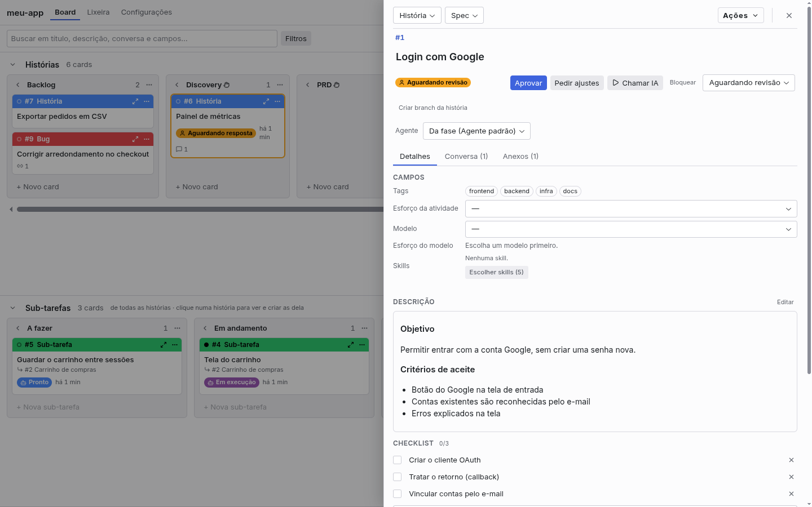
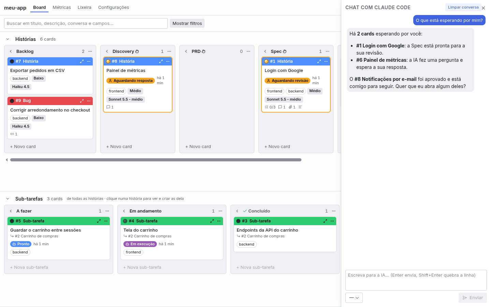
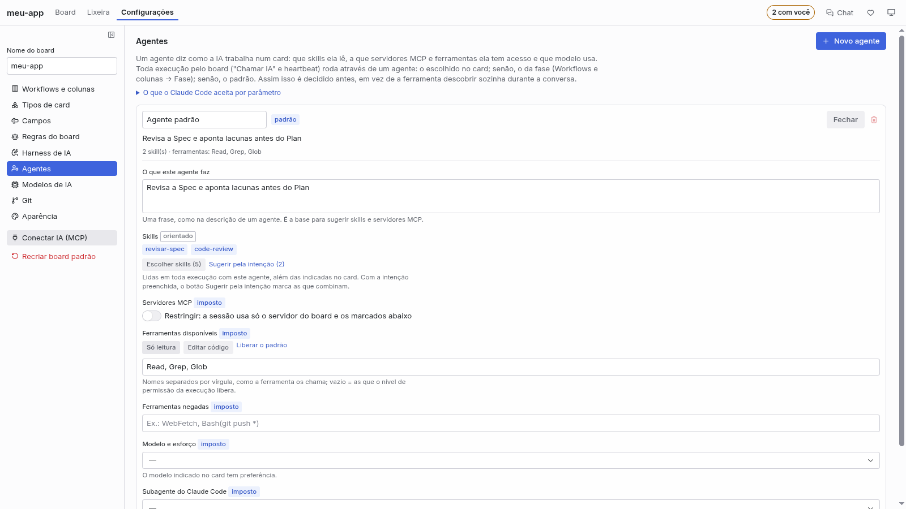
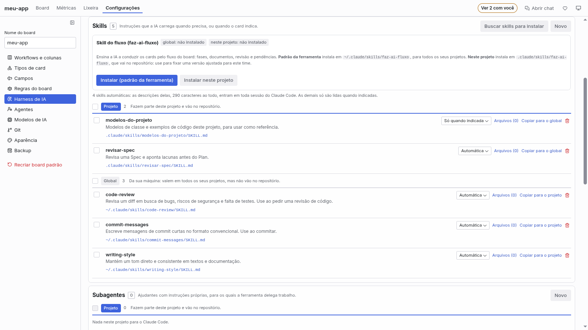

🇧🇷 Português · [🇺🇸 English](README_EN.md)


# Faz AI Kanban

> ⚠️ **O Faz AI está em fase alpha.**
>
> O projeto é novo e muda rápido: quase toda semana sai uma versão, e nem tudo foi testado em todas
> as ferramentas de IA e sistemas operacionais. Erros e comportamentos inesperados podem acontecer,
> e telas, comandos e o formato do board ainda podem mudar de uma versão para outra.
>
> Use à vontade, mas com esse cuidado em mente: revise o que a IA fizer antes de aprovar e não
> dependa do board como único registro de algo importante. Se algo quebrar ou parecer estranho,
> [conte numa issue](https://github.com/euclidesgc/faz-ai/issues): é assim que ele sai do alpha.

> **Obrigado a quem está baixando e testando.**
>
> Publiquei a extensão no marketplace do Cursor e fui dormir. Quando acordei para instalá-la na
> minha máquina de trabalho, ela já tinha 160 downloads. Eu não esperava isso, e fiquei muito feliz.
>
> A cada pessoa que instalou, abriu o board e deu uma chance a um projeto que acabou de nascer:
> muito obrigado. É por vocês que ele continua.
>
> O Faz AI é **totalmente gratuito e open source** (licença MIT), e contribuições são bem-vindas:
> conte o que funcionou e o que não funcionou, [abra uma issue](https://github.com/euclidesgc/faz-ai/issues)
> ou [mande um pull request](https://github.com/euclidesgc/faz-ai/pulls).
>
> Euclides G Catunda

> **Gostou? Ajude o Faz AI a crescer.**
>
> Um projeto novo melhora com o retorno de quem usa. Se ele já te poupou tempo, estes gestos de um
> minuto fazem muita diferença:
>
> - ⭐ **Dê uma estrela** no [repositório do GitHub](https://github.com/euclidesgc/faz-ai): é o que
>   mais ajuda outras pessoas a encontrarem o projeto.
> - 💬 **Avalie a extensão** na loja onde você a instalou, com estrelas e, se puder, duas linhas
>   sobre o que achou: [VS Code Marketplace](https://marketplace.visualstudio.com/items?itemName=euclidesgc.faz-ai&ssr=false#review-details)
>   ou [Open VSX](https://open-vsx.org/extension/euclidesgc/faz-ai/reviews) (a loja do Cursor).
> - 🐞 **Encontrou um bug?** [Abra uma issue](https://github.com/euclidesgc/faz-ai/issues/new?template=bug.yml)
>   dizendo o que você fez, o que esperava e o que aconteceu. A versão da extensão e o editor que
>   você usa ajudam bastante.
> - 💡 **Tem uma ideia ou sugestão?** [Conte numa issue](https://github.com/euclidesgc/faz-ai/issues/new?template=sugestao.yml):
>   fluxos que faltam, telas confusas e integrações que você gostaria de ver.
>
> Antes de abrir, vale uma olhada nas [issues já abertas](https://github.com/euclidesgc/faz-ai/issues):
> às vezes a ideia já existe, e um 👍 nela ajuda a decidir a ordem do que vem a seguir.

Um board kanban dentro do editor (VS Code e Cursor), feito para conduzir Spec-Driven Development
(SDD) junto com uma IA. Você organiza o trabalho em histórias e sub-tarefas; a IA lê o board, produz
os artefatos de cada fase e move os cards conforme avança.


## Primeiros passos

Em cinco minutos você tem uma tarefa andando no board, com a IA trabalhando nela.

1. **Instale e abra.** Instale **Faz AI Kanban** no VS Code ou no Cursor (pelo marketplace da
   própria ferramenta), abra a pasta do seu projeto e clique no ícone **Faz AI** na barra lateral.
   Cada pasta tem o seu board, já com as fases do fluxo.
2. **Conecte a IA ao board.** Em **Configurações → Harness de IA**, escolha a ferramenta do projeto
   (Claude Code, Codex, Cursor, Kimi Code ou GitHub Copilot) e clique em **Conectar IA (MCP)**. Na
   aba **Do projeto**, clique em **Instalar skill do fluxo**: ela ensina a IA a conduzir as fases.
3. **Crie a tarefa.** Na coluna **Backlog**, clique em **+ Novo card**, escreva o título (por
   exemplo, "Login com Google") e dê Enter. Duplo clique abre o card: descreva o que você quer, em
   Markdown, e, se quiser, escolha o modelo da IA e as skills que ela deve ler.
4. **Deixe a IA começar.** Arraste o card para **Discovery** e clique em **Chamar IA** no card. A IA
   lê o card pelo board, analisa o problema e conversa com você na aba **Conversa**. Quando termina,
   o status muda para **Aguardando revisão**: é a sua vez.
5. **Revise e siga.** Leia o documento da fase, responda ou clique em **Aprovar** (ou **Pedir
   ajustes**). Com a aprovação, a história avança para **PRD**, **Spec**, **Plan** e
   **Implementação**, sempre com a IA produzindo e você aprovando. As sub-tarefas da implementação
   nascem no workflow de baixo e a IA as conclui uma a uma.

Para o dia a dia: o contador **N com você** no topo mostra o que espera por você, o **Chat** deixa
você pedir à IA, em linguagem natural, para criar e mover cards, e o **heartbeat** pode chamar a IA
sozinho quando há pendência com ela.

### Por que isso poupa contexto

A IA gasta contexto com o que carrega em toda sessão. O board existe para ela carregar só o
necessário, na hora certa:

- **Cada card é uma sessão nova e curta.** Em vez de uma conversa longa que acumula tudo, a IA abre o
  card pelo board (`get_card`), faz aquele trabalho e para. O histórico fica no card, e não na janela
  de contexto.
- **Skills só quando indicadas.** Uma skill automática põe a descrição dela em toda sessão; marcada
  como **Só quando indicada**, ela só entra nos cards que a pedem. Em **Harness de IA → Tudo que a
  ferramenta carrega**, o board mostra quantas skills são automáticas e quantos caracteres de
  descrição elas colocam em toda sessão.
- **Agentes que restringem.** Um agente pode liberar só alguns servidores MCP e ferramentas, e a
  **sessão limpa** dispensa as personalizações da sua pasta de usuário: menos definições de
  ferramentas carregadas sem necessidade (o que o Claude Code e o Cursor impõem por parâmetro está na
  tabela de [Agentes](#agentes)).
- **Documentos como anexos.** PRD, Spec e Plan ficam anexados à história; a IA os lê quando o card
  precisa, em vez de recebê-los colados em cada mensagem.
- **Modelo certo para cada tarefa.** Regras de sugestão e o modelo por card ou por agente evitam usar
  o modelo mais caro onde o mais leve basta.

A economia de contexto de skills sob demanda é documentada no Claude Code e no Cursor; nas outras
ferramentas, a documentação diz só que a IA deixa de invocar a skill sozinha. O board não promete
um percentual: ele mostra, no inventário, o que está sendo carregado.

## Para que serve

- **Planejar em fases.** As colunas das histórias são as fases do fluxo: Backlog, Discovery, PRD,
  Spec, Plan, Implementação, Homologação, Concluído e Cancelado. Cada história se desdobra em
  sub-tarefas, que têm um fluxo próprio (A fazer, Em andamento, Concluído).
- **Dizer à IA o que fazer em cada fase.** Cada coluna tem uma instrução para a IA e, se a fase
  gera um documento (Discovery, PRD, Spec, Plan), o modelo desse documento. No Discovery a IA
  analisa o problema e conversa com você antes de qualquer requisito; na Homologação a história só
  é concluída com a sua aprovação.
- **Trabalhar com a IA no mesmo quadro.** A extensão expõe o board por MCP. Claude Code, Codex,
  Cursor, Kimi Code, GitHub Copilot ou outro cliente MCP podem consultar e editar tudo o que a interface permite, e
  as mudanças aparecem no board na hora.
- **Saber com quem está cada card.** Todo card em que a IA atua tem um status (Pronto, Em execução,
  Aguardando resposta, Aguardando revisão, Aprovado, Bloqueado) que mostra se a pendência está com
  você ou com a IA.
- **Revisar antes de a IA avançar.** Nas colunas que exigem aprovação (Discovery, PRD, Spec, Plan
  e Homologação, por padrão), a IA termina o trabalho, pede a revisão e para. Ela só move o card depois que você aprova.
- **Ver o que espera por você.** O filtro "Com você", o contador no ícone da barra lateral e um
  aviso do editor mostram quando a IA pede revisão, faz uma pergunta ou trava num impedimento. A IA,
  por sua vez, pergunta ao board o que está com ela.
- **Dizer à IA como executar cada card.** Cada card pode indicar o modelo, o nível de esforço e as
  skills obrigatórias. O modelo pode ser sugerido por regras a partir do tamanho da tarefa.
- **Decidir antes o que a IA usa.** Um agente define as skills, os servidores MCP, as ferramentas e o
  modelo de cada fase ou card, em vez de a ferramenta descobrir sozinha durante a conversa. Toda
  execução pelo board roda através de um agente.
- **Ver e configurar o harness inteiro.** Para cada ferramenta de IA instalada, o board mostra o
  que ela carrega (instruções, skills, subagentes, comandos, hooks, servidores MCP, plugins e
  configurações), separado entre o projeto, a sua pasta de usuário e os plugins.

## Como usar

1. Abra uma pasta no editor e clique no ícone **Faz AI** na barra lateral. Cada pasta tem o seu board.
2. Crie histórias com **+ Novo card** e arraste-as entre as colunas. Clicar numa história mostra só
   as sub-tarefas dela; duplo clique abre o detalhe.
3. No detalhe do card ficam o status, a descrição em Markdown, os campos, o checklist, as
   sub-tarefas, a conversa e os anexos. A conversa é o lugar em que você e a IA falam sobre o card.
   Os documentos das fases (PRD, Spec, Plan…) são construídos nas sub-tarefas, mas ficam anexados à
   história; nas sub-tarefas eles aparecem como links.
4. Busque por texto ou pelo ID (`#12`). A seção **Filtros** da barra lateral filtra por tipo,
   campos, datas e relacionamentos.
5. Cards podem ser arquivados (coluna "Arquivados" no fim de cada linha) ou enviados para a
   **Lixeira**, de onde podem ser restaurados.



Por padrão, uma história não é concluída nem avança de fase enquanto tiver sub-tarefas em aberto
daquela fase. Essas regras podem ser desligadas nas configurações.

No topo do board, **N com você** mostra quantos cards esperam revisão, resposta ou desbloqueio (um
clique filtra só eles), e um indicador aparece enquanto a IA trabalha em algum card.

Cada card tem uma barra na cor do tipo, com o ID, o tipo e os botões de abrir e de ações. Abaixo
vêm o título (inteiro no tooltip, se não couber), o status com um ícone de com quem está a
pendência (robô para a IA, pessoa para você) e há quanto tempo ele está assim, os campos, o modelo
de IA (ex.: "Sonnet 5.5 - baixo") e, no rodapé, os contadores, a branch e o PR. Cards com
pendência sua ganham a borda na cor do status, e o LED da barra pisca devagar enquanto a IA trabalha no card (na história, também quando ela trabalha numa sub-tarefa); quando ela termina, o LED continua lá, apagado.

### Vínculos entre cards

Além das sub-tarefas, qualquer card pode ser vinculado a outro, de qualquer workflow, em **Vínculos**
no card aberto (como em Kanbanize ou Businessmap): **pai**, **filho** ou **relativo**. Busque o
outro card pelo número ou título e escolha o tipo do vínculo. O rodapé do card no board mostra o
vínculo e, se há filhos, quantos já estão encerrados. O vínculo repetido e o que fecharia um ciclo
(o pai já ser filho do card) são recusados.

Um pai vinculado segue a regra de Configurações → Regras: quando o último filho em aberto entra numa
coluna de conclusão, o board pergunta (ou move sozinho, conforme a regra) se o pai também vai para a
conclusão. A IA usa as ferramentas `link_cards` e `unlink_cards`, e o `get_card` devolve os
vínculos.

### Board no navegador, fora do editor

O board não depende da janela do editor:

- **Abrir no navegador** (no topo do board, ou o comando **Faz AI: Abrir board no navegador**)
  abre o mesmo board numa aba do navegador. O editor continua aberto e é ele que guarda o board;
  as duas telas ficam sincronizadas.
- **Sem o editor**: rode `~/.faz-ai/bin/faz-ai` na pasta do projeto (ou `faz-ai <pasta>`). O
  comando serve o board no navegador, com o servidor MCP, a execução da IA e o heartbeat, e fica
  rodando até você encerrar com Ctrl+C. O atalho é criado pela extensão e usa os mesmos dados dela;
  precisa do Node.js no PATH. Para chamar só `faz-ai`, ponha `~/.faz-ai/bin` no PATH.
  `faz-ai --help` lista as opções (`--port`, `--data`, `--no-open`).

A página só responde em `127.0.0.1` e exige o segredo que vem no link aberto pelo editor ou pelo
terminal (ele fica guardado num cookie, então o endereço pode ir para os favoritos). O tema
"Sistema" acompanha o claro ou escuro do VS Code no editor e o do sistema operacional no navegador,
sempre com as cores do próprio board. No navegador, os filtros abrem na própria barra do board. Um
board é servido por um lugar de cada vez: com o editor aberto na pasta, use **Abrir no navegador**;
o `faz-ai` do terminal avisa e não inicia.

## Usando com IA

1. Em Configurações → **Harness de IA**, escolha a ferramenta do projeto (Claude Code, Codex,
   Cursor, Kimi Code ou GitHub Copilot).
2. Clique em **Conectar IA (MCP)**. O board registra o servidor no arquivo que a ferramenta lê.
3. Em **Harness de IA**, na aba **Do projeto**, clique em **Instalar skill do fluxo**: ela ensina a IA a conduzir os cards
   pelas fases, gerar os documentos, pedir revisão e retomar pendências. É um arquivo do projeto e
   pode ser editado.
4. Abra uma sessão nova da ferramenta na pasta do projeto e peça, por exemplo, "liste os cards do
   board", "pegue a história #1 e escreva o PRD" ou "veja o que está pendente no board e dê andamento".

Fluxo sugerido: a IA lê a história e a instrução da fase, cria uma sub-tarefa para construir o
documento da fase, anexa o documento à história e pede a revisão pela conversa do card. Você
responde no próprio card:

- **Aprovar** deixa o card Aprovado, e a IA o leva para a próxima coluna.
- **Pedir ajustes** devolve o card para a IA com o seu texto na conversa.
- Se a IA fizer uma pergunta, o card fica Aguardando resposta; ao responder na conversa, ele volta
  para a IA.
- **Bloquear** registra um impedimento, com o motivo.

### Chat com a IA



Para dar ordens ao board em linguagem natural, use o **Chat**: na barra lateral do editor, a seção
**Chat com a IA** (abaixo de Board e Filtros); no navegador, o botão **Chat** do topo, que abre um
painel à direita. Escreva, por exemplo, "crie uma história Login com Google e três sub-tarefas" ou
"o que está esperando por mim?". A IA do projeto responde e age pelas ferramentas do board: cria,
move e vincula cards, e consulta o que há nele. Abaixo do campo você escolhe o **modelo e o esforço**
das próximas mensagens (a escolha fica lembrada). Enter envia, Shift+Enter quebra a linha, **Parar**
interrompe e **Limpar** apaga a conversa. O histórico fica guardado por projeto.

O chat usa a mesma execução em segundo plano dos cards, então vale o limite de Configurações →
Harness de IA → "O que a IA pode fazer" (por padrão, só o board) e o tempo limite de lá.

### Chamar a IA pela conversa

Na conversa de qualquer card, **Chamar IA** roda a ferramenta do projeto em segundo plano para ler
a conversa e trabalhar naquele card. Não é um chat ao vivo: a resposta chega como mensagem na
conversa quando a execução termina, e enquanto isso o card fica "Em execução" (com um botão
**Parar**). Imagens coladas na mensagem viram anexos do card e a IA as recebe.

O botão também fica no cabeçalho do card, ao lado do status.

- O que a IA pode fazer nessas execuções se define em Configurações → Harness de IA → **Execução
  pela conversa**: só o board (padrão), board e arquivos do projeto, ou sem restrições. O nível em
  uso aparece ao lado do botão, com um atalho para mudar. A IA é avisada do limite: se o trabalho
  pedir mais do que o nível permite, ela bloqueia o card dizendo qual opção escolher.
- Cursor e Kimi Code, quando rodam em segundo plano, só funcionam no nível "sem restrições".
- A ferramenta precisa estar instalada e autenticada. A CLI não precisa estar no PATH: o board a
  procura também nas pastas de instalação usuais e dentro das extensões do editor (quem só usa a
  extensão do Claude Code ou do Codex já tem o executável).
- Com o Claude Code, o servidor do board vai na linha de comando de cada execução: não depende de
  **Conectar IA (MCP)** nem da aprovação do `.mcp.json`. Nas outras ferramentas, conecte antes.
- Se a execução falhar ou passar do tempo limite, o card fica Bloqueado com o motivo e o fim da
  saída da ferramenta. O log completo está no painel **Saída → Faz AI** (ou no terminal do `faz-ai`).

### Branch e pasta de trabalho por história

Cada história trabalha numa branch própria, criada pelo board (ex.: `historia/12-login-com-google`).
Por padrão ela vem com uma worktree: uma pasta de trabalho separada, ao lado do projeto, onde a IA
altera o código sem tocar na sua pasta nem nas suas alterações em andamento. As sub-tarefas fazem
commits na branch da história.

- A branch é criada quando a IA começa a implementação (ela chama `prepare_workspace`) ou pelo
  botão **Criar branch da história** no card.
- O card mostra a branch e abre a pasta de trabalho numa janela nova.
- Em Configurações → **Git** ficam o modo (worktree, branch na própria pasta ou desligado), o
  padrão do nome da branch, a pasta das worktrees, o merge automático do PR ao aprovar a homologação
  e a detecção automática de merges (ligada por padrão).
- Cada worktree é uma cópia de trabalho: as dependências precisam ser instaladas nela.

### Pull request e merge na Homologação

Na Homologação a IA envia a branch, abre o pull request da história, registra o endereço no card e
pede a sua revisão. O card mostra o link do PR.

O merge automático é opcional e começa desligado (Configurações → Git). Com ele ligado, quando você
aprova uma história que está na última coluna antes da conclusão:

1. o board faz o merge do PR pelo GitHub CLI (`gh`), no tipo configurado (squash, merge ou rebase);
2. só com o merge feito o card vai para Concluído, e a pasta de trabalho da história é removida;
3. se o merge falhar (conflito, checks obrigatórios, sem acesso), o card fica Bloqueado com o erro
   e continua na Homologação.

O merge não acontece se a história não tiver PR registrado ou ainda tiver sub-tarefas em aberto. Com
o merge automático desligado, aprovar só marca o card, e a IA o move para Concluído.

### Detecção automática de merges

O board pode observar o pull request de uma história entregue e detectar quando ele é mergeado,
concludendo a história automaticamente. A feature começa ligada (Configurações → Git, **Concluir a
história quando o pull request for mergeado**). Uma rotina periódica verifica o estado do PR a cada
intervalo configurável (**Verificar a cada (minutos)**, padrão 15, intervalo de 5 a 1440). Quando
o merge é detectado:

1. o board grava o commit do merge no card;
2. registra na conversa que a história foi concluída;
3. move o card para Concluído e remove a pasta de trabalho.

Se o pull request é fechado sem merge, o board registra um aviso na conversa uma única vez. O merge
continua sendo feito pela pessoa, manualmente ou pelo merge automático; o board só observa. Falhas
na consulta do estado do PR (sem ligação, sem autenticação, etc.) não bloqueiam nada — o aviso
aparece no log, e a rotina continua tentando no próximo intervalo.

### Heartbeat

Com o heartbeat ligado (Configurações → Harness de IA), o board chama a IA sozinho a cada
intervalo, enquanto o editor estiver aberto na pasta do projeto. Em cada rodada ela avança os cards
aprovados, responde às mensagens pendentes e trabalha nos cards prontos, uma história por vez.

- Sem pendência com a IA, nada é executado.
- A fila da rodada segue a ordem do board: os bugs primeiro e, depois, de cima para baixo — o que
  decide é a posição do card, não o número dele nem o que já foi aprovado.
- Cards que estão com você (aguardando revisão ou resposta, bloqueados) não são tocados, a menos
  que você tenha deixado uma mensagem sem resposta na conversa.
- **Rodar agora** (nas configurações ou pelo comando **Faz AI: Rodar o heartbeat agora**) começa
  uma rodada na hora, mesmo com o heartbeat desligado. **Faz AI: Parar as execuções da IA e o modo autônomo**
  interrompe tudo.
- A barra de status mostra os cards em execução e a hora da próxima rodada.
- O **coração** no topo direito do board mostra o heartbeat: vermelho e batendo quando ele está
  rodando; cinza e parado quando está desligado ou não consegue rodar (sem ligação com o Faz AI ou
  sem a ferramenta). Clicar nele liga e desliga o heartbeat.
- As execuções usam a mesma permissão e o mesmo tempo limite do botão "Chamar IA".

Quais colunas exigem aprovação, e em quais a IA atua, se define em Configurações → Workflows e
colunas. Você mesmo pode mover qualquer card sem aprovação.

### Modo autônomo (YOLO)

Uma **história** pode ser marcada como **YOLO**: no painel do card, ligue **Modo autônomo (YOLO)**
(o board pede uma confirmação, porque o modo abre mão de toda aprovação). A partir daí a IA toca a
história sozinha, **sem pedir autorização nem confirmação para nada**:

- Do **Backlog** até a última coluna em que a IA atua (Homologação, no board padrão): ela faz o
  Discovery, o PRD, a Spec e o Plan, cria as sub-tarefas, implementa uma por uma e, nessa última
  coluna, abre o pull request, registra com `set_pull_request` e para ali — a história fica
  aguardando a sua revisão. As colunas que exigem aprovação deixam de segurar o card, e o pedido de
  revisão da IA vira aprovação na hora, com o resumo registrado na conversa.
- **Sem perguntas**: a IA não usa `ask_question`; diante de uma dúvida ela decide e registra a
  decisão e o motivo na conversa. Só um impedimento real (acesso, ambiente, falha que ela não
  resolve) bloqueia o card.
- **Sem merge**: a IA para na última coluna em que atua, com o pull request aberto; o merge e o
  avanço até Concluído continuam sendo seus. Concluído quer dizer mergeado.
- **Sem restrições**: nas execuções do modo, a IA roda com a permissão "Sem restrições" (altera
  arquivos e roda comandos), porque precisa de git e do `gh`. Ligar o modo é aceitar isso para a história.
- **Em fila e em pilha**: o **autopiloto** toca as histórias em modo autônomo uma de cada vez, na
  ordem do board — bugs na frente, depois de cima para baixo —, e segue para a próxima história da
  fila assim que a atual é entregue (parada na última coluna da IA, com o pull request registrado),
  sem esperar a sua revisão nem o intervalo do heartbeat. A branch de cada história parte da branch da
  história de número anterior que já tem branch, e o pull request é aberto com `--base` nela,
  formando uma pilha de PRs; quando a ordem do board faz uma história rodar antes de outra de
  número menor, a branch dela parte da principal e o pull request sai solto, fora da pilha.
- **Dividir um pedido grande**: a IA pode criar as histórias seguintes a partir de uma história em
  modo autônomo (`create_card` com `autonomous_from`). Elas nascem em modo autônomo e entram na
  fila. Ela nunca liga o modo numa história que você não ligou.
- **Freios**: o autopiloto para quando a IA bloqueia o card ou quando uma execução falha (o card
  fica Bloqueado, com o motivo) e bloqueia a história depois de 3 execuções seguidas que não
  avançaram nada. Ao destravar o card, ele continua sozinho.

O **botão "Autônomo"** no topo do board aparece enquanto houver história na fila: aceso quando o
autopiloto está tocando, apagado quando está pausado; um clique pausa (e interrompe a IA) ou
retoma. Pelo editor: **Faz AI: Pausar o modo autônomo (YOLO)**, **Faz AI: Retomar o modo autônomo
(YOLO)** e **Faz AI: Parar as execuções da IA e o modo autônomo**. Ao abrir o editor, o autopiloto
não começa sozinho: ele liga quando você ativa o modo numa história ou retoma. O heartbeat não
toca histórias em modo autônomo; elas são do autopiloto.


### Agentes



Um agente (Configurações → **Agentes**) diz como a IA trabalha num card: que skills ela lê, a que
servidores MCP e ferramentas (disponíveis e negadas) tem acesso, que modelo e esforço usa e se a
sessão é limpa (sem as personalizações da sua pasta de usuário e sem invocação automática de
skills). Toda execução pelo board roda através de um agente: o escolhido no card; senão, o da fase
(Workflows e colunas → Fase); senão, o padrão do board. O board sempre tem ao menos um, o **Agente
padrão**, que não restringe nada.

Para configurar sem ter de conhecer cada skill ou ferramenta:

- **O que este agente faz**: uma frase de intenção. Com ela, o botão **Sugerir pela intenção** marca
  as skills (e os servidores MCP) cujo nome ou descrição combinam. A sugestão é por palavras, local
  e sem chamar IA; você confirma o que fica.
- **Skills**: a mesma janela de escolha do card, com busca, abas por origem e caixa de seleção.
- **Ferramentas**: conjuntos prontos (**Só leitura**, **Editar código**) e a lista editável.
- **Subagente da ferramenta**: opcional, um arquivo de agente da própria ferramenta (por exemplo,
  `.claude/agents/revisor.md`) para conduzir a sessão.

Cada execução pelo board ("Chamar IA" e heartbeat) é uma sessão nova, só com o que está no card. O
agente vira parâmetros da linha de comando onde a ferramenta aceita; o resto segue no prompt, como
instrução:

| Ferramenta | Imposto por parâmetro | Só orientado |
| --- | --- | --- |
| Claude Code | subagente, servidores MCP, ferramentas, modelo e esforço, sessão limpa | skills |
| GitHub Copilot | subagente, servidores MCP, ferramentas, modelo e esforço | skills, sessão limpa |
| Kimi Code | subagente, modelo | skills, servidores MCP, ferramentas, sessão limpa |
| Codex | servidores MCP, modelo e esforço | subagente, skills, ferramentas, sessão limpa |
| Cursor | modelo | todo o resto |

As skills vão sempre pelo caminho do arquivo. Numa conversa aberta por você, o agente chega à IA
pelo `get_card`, como orientação.

## Harness de IA



Em Configurações → **Harness de IA** fica tudo que as ferramentas de IA carregam, em três abas:
**Ferramenta e execução** (a IA do projeto e como o board a chama), **Do projeto** (o arquivo de
regras, as skills e os agentes que fazem parte do repositório, editáveis ali) e **Tudo que a
ferramenta carrega**. Nesta última, em **Tudo que cada ferramenta carrega**, há uma aba por ferramenta com oito seções (instruções e regras, skills,
subagentes, comandos e prompts, hooks, servidores MCP, plugins, configurações e permissões), cada uma
dividida em três escopos:

- **Projeto**: arquivos desta pasta; valem só aqui e vão no repositório. Esse grupo aparece sempre,
  em destaque, e diz quando o projeto não tem nada daquele tipo.
- **Global**: arquivos da sua pasta de usuário (`~/.claude`, `~/.codex`, `~/.copilot`…); valem em
  todos os seus projetos. Toda alteração neles pede confirmação.
- **Plugins**: vêm de pacotes instalados; não são alterados pelo board, mas podem ser copiados.

O que dá para fazer:

- **Ler a lista sem esforço.** Cada item mostra o nome, a descrição como dica (limitada a duas
  linhas) e, numa linha própria, o caminho do arquivo por inteiro. Clicar no caminho abre o arquivo
  no editor, onde ele também é editado.
- **Agir em vários de uma vez.** Cada linha tem uma caixa de seleção, e a do cabeçalho marca o
  grupo todo. Com itens marcados aparece uma barra: deixar as skills automáticas ou só quando
  indicadas, copiar para o projeto ou para o global, e apagar, sempre com confirmação.
- **Criar** um item no lugar e no formato que a ferramenta espera, **apagar**, e **copiar** skills,
  subagentes, comandos e regras do global ou de um plugin para o projeto (e do projeto para o global).
- **Servidores MCP**: acrescentar e remover, no formato de cada arquivo.
- **Hooks e permissões**: acrescentar e remover hooks e regras de permitir, perguntar e negar.
- **Buscar e instalar skills** de uma pasta ou de um repositório git: o board lista as skills
  encontradas e copia só as que você escolher. Nada do repositório é executado.

### Skills sob demanda

Cada skill tem um modo:

- **Automática**: a IA vê a descrição em toda sessão e decide quando usar.
- **Só quando indicada**: a IA não a invoca sozinha; vale quando um card a indica ou quando é
  chamada pelo nome.
- **Desligada** (só no projeto): a ferramenta não a enxerga, mas um card ainda pode indicá-la.

O campo "Skills" do card mostra um resumo do que está marcado e abre uma janela para escolher: busca
por nome ou descrição, abas **Todas / Marcadas / Projeto / Globais / Plugins** e uma caixa de seleção
por skill, com a origem à vista. Funciona com centenas de skills. O card entrega à IA o caminho do arquivo de cada skill, então ela não
precisa estar à vista da ferramenta para ser usada. Assim dá para ter muitas skills disponíveis sem
ocupar o contexto de toda sessão. A economia de contexto é documentada no Claude Code e no Cursor;
nas outras ferramentas, a documentação diz só que a IA deixa de invocar a skill sozinha.

Para não marcar skills card a card, escolha-as no tipo: em Configurações → **Tipos de card** →
**Padrões por tipo**, as skills do campo "Skills" (e o modelo) ficam preenchidas em todo card novo
daquele tipo. Cada card ainda pode mudá-las.

### Modelos e referências

Modelos de classe e exemplos de código ficam dentro da pasta da skill (`references/`, `assets/`,
`scripts/`). O botão **Arquivos** de cada skill lista, cria e apaga esses arquivos, e **Criar skill
de modelos** cria no projeto uma skill própria para eles. O card que indica a skill recebe os
caminhos dos arquivos de apoio.

O editor precisa estar aberto na pasta do projeto para a IA alcançar o board. O registro manual, os
formatos de cada ferramenta e a solução de problemas estão em [docs/mcp.md](docs/mcp.md).

## Configurações


| Seção | O que ajusta |
| --- | --- |
| Workflows e colunas | Quantos workflows quiser (cards independentes ou sub-tarefas), com nome editável e posição que você muda arrastando; **Nova coluna** em cada um; nomes, ordem (arrastando) e significado das colunas; em quais a IA atua e quais exigem aprovação; a fase de cada coluna (instrução para a IA e modelo do documento). Abrir e fechar workflows e colunas é feito no próprio board e fica lembrado |
| Tipos de card | História, Bug, Sub-tarefa…, com cor e valores padrão de campos por tipo |
| Campos | Campos personalizados (texto, seleção, data, modelo…) e onde aparecem; opções de seleção que são tecnologias (Flutter, React, Python…) ganham o logo |
| Regras do board | Bloqueios de conclusão e de avanço de fase, confirmações, preenchimento do modelo sugerido |
| Agentes | Como a IA trabalha em cada card: skills, servidores MCP, ferramentas e modelo; sempre há um padrão; por fase, com troca por card e sugestão pela intenção |
| Harness de IA | Ferramenta do projeto, arquivo de regras, skills e agentes; execução pela conversa e heartbeat; tudo que cada ferramenta carrega, por escopo (ver [Harness de IA](#harness-de-ia)) |
| Modelos de IA | Modelos e níveis de esforço da ferramenta; regras que sugerem o modelo de cada card |
| Git | Branch e pasta de trabalho (worktree) de cada história: modo, nome da branch, pasta; merge automático do PR ao aprovar a homologação |
| Aparência | **Idioma** (automático, Português (Brasil) ou English), tema (sistema, claro, escuro), fonte e tamanho dos textos longos; nome e cor dos status |

Sobre os modelos: **Detectar modelos** lê a lista da ferramenta (no Kimi Code, da configuração
local; nas outras, uma lista embutida que pode ser editada). As regras de sugestão combinam
condições com E e OU, por exemplo `Esforço da atividade = Alto E Tags = backend`. O resultado é
sempre uma sugestão: no card, o modelo e o esforço podem ser trocados a qualquer momento.

Quando uma versão nova da extensão muda o board padrão, o board pergunta se você quer atualizá-lo
(ou use **Faz AI: Atualizar board para o padrão atual**). A atualização só acrescenta o que falta:
nenhum card sai do lugar e o que você personalizou é mantido. Uma cópia do banco é gravada antes.

## Onde ficam os dados

O board e os anexos ficam no armazenamento da extensão, fora do repositório. Cada pasta tem o seu
arquivo de banco (`boards/<chave da pasta>.db`), então janelas em projetos diferentes não
interferem uma na outra. Na primeira vez, o board parte de uma cópia do banco único das versões
anteriores (`fazai.db`), que fica intacto. Regras e skills são arquivos da pasta do projeto e
entram no git normalmente. Evite abrir a mesma pasta em duas janelas do editor ao mesmo tempo: a
última a salvar vence (a extensão avisa quando isso acontece).

## Desenvolvimento

```sh
npm install
npm run build
npm test
npm run typecheck
```

O `npm test` também roda o lint e confere a formatação; `npm run format` formata tudo. Para o
`git blame` pular o commit que só formatou o código: `git config blame.ignoreRevsFile .git-blame-ignore-revs`.

Pressione `F5` para abrir o Extension Development Host. O código fica em `src/extension` (host e
servidor MCP), `src/webview` (interface em React), `src/shared` (modelo, protocolo e as regras do
board usadas pelo host e pela interface), `src/mcp-bridge` (ponte stdio usada pelos clientes de IA)
e `src/cli` (o board fora do editor).

Para testar a interface sem o editor, `node dist/cli.js <pasta> --data <pasta de dados de teste>`
serve o board no navegador. Os testes cobrem a ativação da extensão (com um editor de mentira em
`test/fakes/vscode.ts`) e o servidor da página (`test/webServer.test.ts`).

### Preparar o ambiente de desenvolvimento

O repositório tem todo o código, mas alguns itens ficam fora do git. Num clone novo (outra máquina,
por exemplo), eles precisam ser refeitos:

| Item | Para que serve | Como obter |
|---|---|---|
| Node.js 18+ e git | build, testes e o comando `faz-ai` | instalação normal |
| `.mcp.json` e `.claude/settings.local.json` | ligam a IA ao board; guardam caminhos da máquina | **Conectar IA (MCP)** nas configurações do board |
| Board e anexos | ficam no armazenamento da extensão, não no repositório | o board da pasta começa vazio na outra máquina |
| `.env.release` com `OVSX_PAT` | publicar no Open VSX | token em https://open-vsx.org/user-settings/tokens |
| Login da Azure CLI | publicar no VS Code Marketplace | `az login --allow-no-subscriptions`, com a conta dona do publisher |
| `gh` autenticado | criar a GitHub Release | `gh auth login` |
| `.claude/skills/publicar-extensao/` | passo a passo da publicação para a IA | copiar a pasta da máquina original |

Os três últimos só são necessários para publicar. A `main` só aceita mudanças por pull request, e o
script já cuida disso: `npm run release -- <patch|minor|major>` parte da main atualizada e limpa,
testa, cria a branch `release/vX.Y.Z` e nela ajusta a versão e os CHANGELOGs ("Não lançado" vira a
versão), faz o commit e empacota. Publica nas duas lojas, envia a branch, abre o PR para a main e,
com o push concluído, faz o merge (squash). Por fim atualiza a main local, apaga a branch de release
(local e remota) e cria a tag e a GitHub Release com o `.vsix`. Se algo parar depois da publicação,
`npm run release -- finish` retoma de onde parou (na branch de release ou na main), sem publicar de
novo. `--dry-run` ensaia sem publicar. As opções estão no topo de `scripts/release.mjs`.

Entre empacotar e publicar, o release abre o `.vsix` e confere os quatro arquivos de vitrine
(`README.md`, `README_EN.md`, `CHANGELOG.md`, `CHANGELOG_EN.md`): o changelog precisa ter o título
da versão que está saindo no topo, sem nenhum "Não lançado"/"Unreleased" sobrando em lugar nenhum, e
o README precisa ter os blocos de aviso de fase alpha e de agradecimento. Falhando qualquer coisa, o
release recusa antes de publicar em qualquer loja. O renomear de "Não lançado" para a versão
acontece em todos os modos, inclusive no `--dry-run`; quando o release não chega a commitar (dry-run
ou `--no-git`), os CHANGELOGs renomeados são restaurados ao original ao final. Sem nenhuma seção
"Não lançado"/"Unreleased" para renomear, use `--allow-no-notes` — só é exigida quando faltar essa
seção **e** a primeira seção do CHANGELOG não for a versão que está saindo.

Dois cuidados:

- se reescrever o texto de um bloco de aviso do README, atualize a tabela `SHOWCASE` em
  `scripts/releaseCheck.mjs` com o novo texto; do contrário o release recusa publicar um README
  correto, por desenho (falso positivo).
- um Ctrl+C no meio do release pode deixar os CHANGELOGs com o título renomeado em disco; desfaça com
  `git checkout CHANGELOG.md CHANGELOG_EN.md`.

## Histórico de versões

O que mudou em cada versão está no [CHANGELOG.md](CHANGELOG.md).

## Licença

[MIT](LICENSE)
