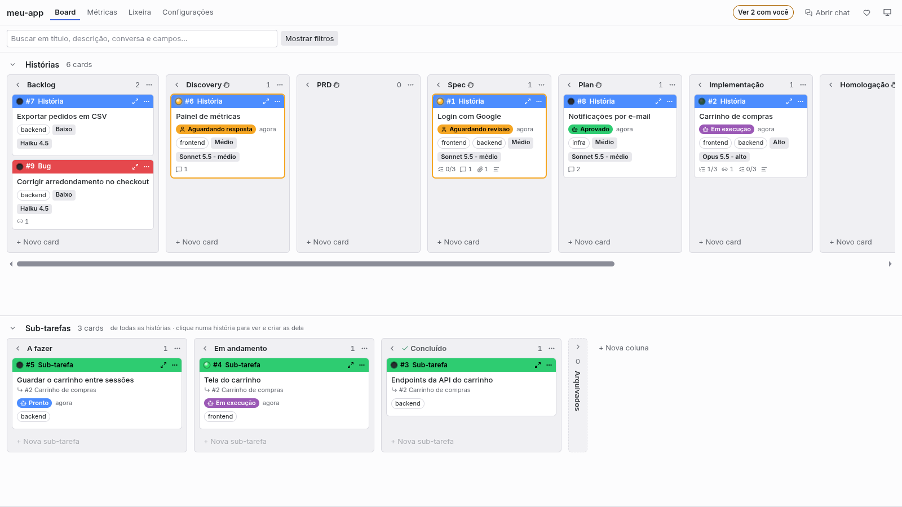
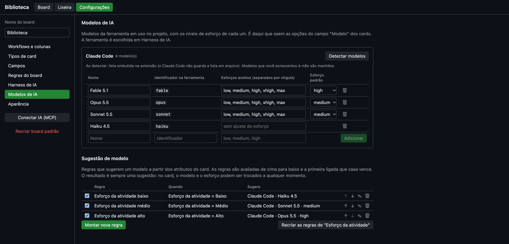

[🇧🇷 Português](README.md) · 🇺🇸 English


# Faz AI Kanban

> ⚠️ **Faz AI is in alpha.**
>
> The project is new and moves fast: a new version ships almost every week, and not everything has
> been tested on every AI tool and operating system. Bugs and unexpected behavior can happen, and
> screens, commands and the board format may still change from one version to the next.
>
> Use it freely, but with that in mind: review what the AI does before approving it, and do not rely
> on the board as the only record of something important. If something breaks or looks odd,
> [tell me in an issue](https://github.com/euclidesgc/faz-ai/issues): that is how it gets out of alpha.

> **Thank you to everyone downloading and trying it out.**
>
> I published the extension to the Cursor marketplace and went to sleep. When I woke up to install
> it on my work machine, it already had 160 downloads. I did not expect that, and it made my day.
>
> To each person who installed it, opened the board and gave a brand-new project a chance: thank
> you. You are the reason it keeps going.
>
> Faz AI is **completely free and open source** (MIT license), and contributions are welcome: tell
> me what worked and what did not, [open an issue](https://github.com/euclidesgc/faz-ai/issues) or
> [send a pull request](https://github.com/euclidesgc/faz-ai/pulls).
>
> Euclides G Catunda

A kanban board inside your editor (VS Code and Cursor), built to run Spec-Driven Development (SDD)
together with an AI. You organize the work into stories and sub-tasks; the AI reads the board,
produces the artifacts of each phase and moves the cards as it goes.

The extension's interface is in Portuguese. This page keeps the names you will see on screen and
gives the English meaning next to them.



## What it is for

- **Plan in phases.** The story columns are the phases of the flow: Backlog, Discovery, PRD, Spec,
  Plan, Implementação (implementation), Homologação (acceptance), Concluído (done) and Cancelado
  (cancelled). Each story breaks down into sub-tasks, which have their own flow: A fazer (to do),
  Em andamento (in progress), Concluído (done).
- **Tell the AI what to do in each phase.** Each column has an instruction for the AI and, if the
  phase produces a document (Discovery, PRD, Spec, Plan), the template for that document. In
  Discovery the AI analyzes the problem and talks to you before any requirement is written; in
  Homologação the story is only completed with your approval.
- **Work with the AI on the same board.** The extension exposes the board over MCP. Claude Code,
  Codex, Cursor, Kimi Code, GitHub Copilot or any other MCP client can read and edit everything the
  interface allows, and the changes show up on the board right away.
- **Know who has each card.** Every card the AI works on has a status: Pronto (ready), Em execução
  (running), Aguardando resposta (waiting for an answer), Aguardando revisão (waiting for review),
  Aprovado (approved) or Bloqueado (blocked). It shows whether the next move is yours or the AI's.
- **Review before the AI moves on.** In columns that require approval (Discovery, PRD, Spec, Plan
  and Homologação by default), the AI finishes the work, asks for review and stops. It only moves
  the card after you approve.
- **See what is waiting for you.** The "Com você" (with you) filter, the counter on the sidebar icon
  and an editor notification show when the AI asks for a review, asks a question or hits a blocker.
  The AI, in turn, asks the board what is waiting for it.
- **Tell the AI how to run each card.** Each card can name the model, the effort level and the
  required skills. The model can be suggested by rules based on the size of the task.
- **Decide beforehand what the AI uses.** An execution profile sets the agent, skills, MCP servers,
  tools and model for each phase or card, instead of letting the tool figure it out during the
  conversation.
- **See and configure the whole harness.** For each AI tool installed, the board shows what it
  loads (instructions, skills, agents, commands, hooks, MCP servers, plugins and settings), split
  between the project, your user folder and plugins.

## How to use it

1. Open a folder in the editor and click the **Faz AI** icon in the sidebar. Each folder has its
   own board.
2. Create stories with **+ Novo card** (new card) and drag them between columns. Clicking a story
   shows only its sub-tasks; double-click opens the details.
3. The card details hold the status, the description in Markdown, the fields, the checklist, the
   sub-tasks, the conversation and the attachments. The conversation is where you and the AI talk
   about the card. Phase documents (PRD, Spec, Plan…) are built in sub-tasks but stay attached to
   the story; in sub-tasks they appear as links.
4. Search by text or by ID (`#12`). The **Filtros** (filters) section of the sidebar filters by
   type, fields, dates and relationships.
5. Cards can be archived (the "Arquivados" column at the end of each row) or sent to the **Lixeira**
   (trash), from where they can be restored.

By default, a story is not completed and does not advance a phase while it has open sub-tasks of
that phase. These rules can be turned off in the settings.

At the top of the board, **N com você** (N with you) shows how many cards are waiting for your
review, answer or unblocking (one click filters to them), and an indicator appears while the AI is
working on a card.

### The board in the browser, outside the editor

The board does not depend on the editor window:

- **Abrir no navegador ↗** (open in browser, at the top of the board, or the command **Faz AI:
  Abrir board no navegador**) opens the same board in a browser tab. The editor stays open and
  keeps the board; both screens stay in sync.
- **Without the editor**: run `~/.faz-ai/bin/faz-ai` in the project folder (or `faz-ai <folder>`).
  It serves the board in the browser, with the MCP server, AI runs and the heartbeat, and keeps
  running until you stop it with Ctrl+C. The launcher is created by the extension and uses the same
  data; it needs Node.js on the PATH. To call just `faz-ai`, add `~/.faz-ai/bin` to your PATH.
  `faz-ai --help` lists the options (`--port`, `--data`, `--no-open`).

The page only answers on `127.0.0.1` and requires the secret in the link opened by the editor or
the terminal (it is then kept in a cookie, so the address can be bookmarked). The "Sistema" theme
follows VS Code's light or dark mode in the editor and the operating system's in the browser,
always with the board's own colors. In the browser, the filters open in the board's own bar. A
board is served from one place at a time: with the editor open on the folder, use **Abrir no
navegador**; the terminal `faz-ai` warns and does not start.

## Using it with AI

1. In Configurações (settings) → **Harness de IA**, choose the project's tool (Claude Code, Codex,
   Cursor, Kimi Code or GitHub Copilot).
2. Click **Conectar IA (MCP)** (connect AI). The board registers the server in the file the tool
   reads.
3. In **Harness de IA**, click **Instalar skill do fluxo** (install the flow skill): it teaches the
   AI to take cards through the phases, write the documents, ask for review and pick up pending
   work. It is a file in your project and can be edited.
4. Open a new session of the tool in the project folder and ask, for example, "list the cards on
   the board", "take story #1 and write the PRD" or "check what is pending on the board and move it
   forward".

Suggested flow: the AI reads the story and the phase instruction, creates a sub-task to build the
phase document, attaches the document to the story and asks for review in the card's conversation.
You answer on the card itself:

- **Aprovar** (approve) marks the card as approved, and the AI takes it to the next column.
- **Pedir ajustes** (request changes) sends the card back to the AI with your text in the
  conversation.
- If the AI asks a question, the card waits for an answer; once you reply in the conversation, it
  goes back to the AI.
- **Bloquear** (block) records a blocker, with the reason.

### Calling the AI from the conversation

In any card's conversation, **Chamar IA** (call AI) runs the project's tool in the background to
read the conversation and work on that card. It is not a live chat: the answer arrives as a message
in the conversation when the run ends, and meanwhile the card shows "Em execução" (with a **Parar**
button to stop it). Images pasted into the message become card attachments and the AI receives them.

The button is also in the card header, next to the status.

- What the AI may do in these runs is set in Configurações → Harness de IA → **Execução pela
  conversa**: only the board (default), the board and project files, or no restrictions. The level
  in use is shown next to the button, with a shortcut to change it. The AI is told about the limit:
  if the work needs more than the level allows, it blocks the card saying which option to choose.
- Cursor and Kimi Code, when running in the background, only work at the "no restrictions" level.
- The tool must be installed and signed in. Its CLI does not need to be on the PATH: the board also
  looks in the usual install folders and inside editor extensions (if you only use the Claude Code
  or Codex extension, you already have the executable).
- With Claude Code, the board's server is passed on the command line of each run: it does not
  depend on **Conectar IA (MCP)** or on approving `.mcp.json`. For the other tools, connect first.
- If the run fails or exceeds the time limit, the card becomes blocked, with the reason and the end
  of the tool's output. The full log is in the **Output → Faz AI** panel (or in the `faz-ai`
  terminal).

### Branch and working folder per story

Each story works on its own branch, created by the board (for example
`historia/12-login-com-google`). By default it comes with a worktree: a separate working folder,
next to the project, where the AI changes the code without touching your folder or your work in
progress. Sub-tasks commit to the story's branch.

- The branch is created when the AI starts the implementation (it calls `prepare_workspace`) or with
  the **Criar branch da história** (create the story's branch) button on the card.
- The card shows the branch and opens the working folder in a new window.
- Configurações → **Git** holds the mode (worktree, branch in the same folder, or off), the branch
  name pattern and the worktrees folder.
- Each worktree is a working copy: dependencies have to be installed in it.

### Pull request and merge in Homologação

In Homologação the AI pushes the branch, opens the story's pull request, records its address on the
card and asks for your review. The card shows the PR link.

Automatic merge is optional and starts turned off (Configurações → Git). With it on, when you
approve a story that is in the last column before completion:

1. the board merges the PR through the GitHub CLI (`gh`), with the configured method (squash, merge
   or rebase);
2. only after the merge the card goes to Concluído, and the story's working folder is removed;
3. if the merge fails (conflict, required checks, no access), the card becomes blocked with the
   error and stays in Homologação.

The merge does not happen if the story has no PR recorded or still has open sub-tasks. With
automatic merge off, approving only marks the card, and the AI moves it to Concluído.

### Heartbeat

With the heartbeat on (Configurações → Harness de IA), the board calls the AI on its own at every
interval, while the editor is open in the project folder. In each round it advances approved cards,
answers pending messages and works on ready cards, one story at a time.

- With nothing pending for the AI, nothing runs.
- Cards that are with you (waiting for review or an answer, blocked) are not touched, unless you
  left an unanswered message in the conversation.
- **Rodar agora** (run now), in the settings or with the command **Faz AI: Rodar o heartbeat
  agora**, starts a round right away, even with the heartbeat off. **Faz AI: Parar as execuções da
  IA** stops everything.
- The status bar shows the cards being run and the time of the next round.
- Runs use the same permission and time limit as the "Chamar IA" button.

Which columns require approval, and in which ones the AI works, is set in Configurações → Workflows
e colunas. You can always move any card yourself without approval.

### Execution profiles

A profile (Configurações → **Perfis de execução**) says what the AI session uses to work on a card:
agent, skills, MCP servers, available and denied tools, model and effort, and whether the session
is clean (without your user-folder customizations and without automatic skill invocation). A
profile applies per phase (Workflows e colunas → Fase), can be changed on each card, and one of
them can be the board default.

Each run started by the board ("Chamar IA" and the heartbeat) is a new session, with only what is
on the card. The profile becomes command-line parameters where the tool accepts them; the rest goes
into the prompt, as instructions:

| Tool | Enforced by parameter | Advised only |
| --- | --- | --- |
| Claude Code | agent, MCP servers, tools, model and effort, clean session | skills |
| GitHub Copilot | agent, MCP servers, tools, model and effort | skills, clean session |
| Kimi Code | agent, model | skills, MCP servers, tools, clean session |
| Codex | MCP servers, model and effort | agent, skills, tools, clean session |
| Cursor | model | everything else |

Skills are always passed by file path. In a conversation you open yourself, the profile reaches the
AI through `get_card`, as guidance.

## AI harness

Configurações → **Harness de IA** holds everything the AI tools load. At the top: the project's
tool, the rules file, and the project's skills and agents. Below, under **Tudo que cada ferramenta
carrega** (everything each tool loads), there is one tab per tool with eight sections (instructions
and rules, skills, agents, commands and prompts, hooks, MCP servers, plugins, settings and
permissions), each split into three scopes:

- **Projeto** (project): files in this folder; they apply only here.
- **Global**: files in your user folder (`~/.claude`, `~/.codex`, `~/.copilot`…); they apply to all
  your projects. Every change to them asks for confirmation.
- **Plugins**: they come from installed packages; the board does not change them, but they can be
  copied.

What you can do:

- **Open** any item in the editor, which is also where it is edited.
- **Create** an item in the place and format the tool expects, **delete** it, and **copy** skills,
  agents, commands and rules from global or from a plugin into the project (and from the project to
  global).
- **MCP servers**: add and remove them, in each file's format.
- **Hooks and permissions**: add and remove hooks and allow, ask and deny rules.
- **Find and install skills** from a folder or a git repository: the board lists the skills it
  finds and copies only the ones you pick. Nothing from the repository is executed.

### On-demand skills

Each skill has a mode:

- **Automática** (automatic): the AI sees the description in every session and decides when to use
  it.
- **Só quando indicada** (only when named): the AI does not invoke it on its own; it applies when a
  card names it or when it is called by name.
- **Desligada** (off, project only): the tool does not see it, but a card can still name it.

The card's "Skills" field offers the project's skills, the global ones and the ones from plugins,
with a Todas / Projeto / Globais (all / project / global) filter. The card hands the AI the file
path of each skill, so a skill does not need to be visible to the tool to be used. That lets you
keep many skills available without filling the context of every session. The context saving is
documented for Claude Code and Cursor; for the other tools, the documentation only says the AI
stops invoking the skill on its own.

### Templates and references

Class templates and code examples live inside the skill's folder (`references/`, `assets/`,
`scripts/`). Each skill's **Arquivos** (files) button lists, creates and deletes those files, and
**Criar skill de modelos** creates a project skill meant for them. A card that names the skill
receives the paths of its supporting files.

The editor has to be open in the project folder for the AI to reach the board. Manual registration,
each tool's formats and troubleshooting are in [docs/mcp.md](docs/mcp.md) (in Portuguese).

## Settings



| Section | What it adjusts |
| --- | --- |
| Workflows e colunas | Names, order (drag the row) and meaning of the columns; where the AI works and which ones require approval; each column's phase (AI instruction and document template); which ones start collapsed |
| Tipos de card | Story, Bug, Sub-task…, with color and default field values per type |
| Campos | Custom fields (text, select, date, model…) and where they appear |
| Regras do board | Completion and phase-advance blocks, confirmations, filling in the suggested model |
| Perfis de execução | What the AI session uses on each card: agent, skills, MCP servers, tools and model; per phase, changeable per card |
| Harness de IA | The project's tool, rules file, skills and agents; runs from the conversation and the heartbeat; everything each tool loads, by scope (see [AI harness](#ai-harness)) |
| Modelos de IA | The tool's models and effort levels; rules that suggest each card's model |
| Git | Branch and working folder (worktree) of each story: mode, branch name, folder; automatic PR merge when the acceptance is approved |
| Aparência | Theme (system, light, dark), font and size of long texts; name and color of the statuses |

About models: **Detectar modelos** (detect models) reads the tool's list (for Kimi Code, from the
local configuration; for the others, a built-in list you can edit). Suggestion rules combine
conditions with AND and OR, for example `Esforço da atividade = Alto E Tags = backend`. The result
is always a suggestion: on the card, the model and the effort can be changed at any time.

When a new version of the extension changes the default board, the board asks whether you want to
update it (or use **Faz AI: Atualizar board para o padrão atual**). The update only adds what is
missing: no card leaves its place and what you customized is kept. A copy of the database is saved
first.

## Where the data lives

The board and the attachments live in the extension's storage, outside the repository. Each folder
has its own database file (`boards/<folder key>.db`), so windows on different projects do not
interfere with each other. The first time, the board starts from a copy of the single database of
earlier versions (`fazai.db`), which is left untouched. Rules and skills are files in the project
folder and go into git as usual. Avoid opening the same folder in two editor windows at the same
time: the last one to save wins (the extension warns when that happens).

## Development

```sh
npm install
npm run build
npm test
npm run typecheck
```

`npm test` also runs the linter and checks formatting; `npm run format` formats everything. To make
`git blame` skip the formatting-only commit: `git config blame.ignoreRevsFile .git-blame-ignore-revs`.

Press `F5` to open the Extension Development Host. The code is in `src/extension` (host and MCP
server), `src/webview` (React interface), `src/shared` (model, protocol and the board rules used by
both host and interface), `src/mcp-bridge` (the stdio bridge used by AI clients) and `src/cli` (the
board outside the editor).

To try the interface without the editor, `node dist/cli.js <folder> --data <test data folder>`
serves the board in the browser. The tests cover the extension's activation (with a fake editor in
`test/fakes/vscode.ts`) and the page server (`test/webServer.test.ts`).

### Setting up the development environment

The repository has all the code, but a few items live outside git. On a fresh clone (another
machine, for example), they must be set up again:

| Item | What it is for | How to get it |
|---|---|---|
| Node.js 18+ and git | build, tests and the `faz-ai` command | regular install |
| `.mcp.json` and `.claude/settings.local.json` | connect the AI to the board; hold machine paths | **Conectar IA (MCP)** in the board settings |
| Board and attachments | live in the extension's storage, not in the repository | the folder's board starts empty on the other machine |
| `.env.release` with `OVSX_PAT` | publishing to Open VSX | token at https://open-vsx.org/user-settings/tokens |
| Azure CLI login | publishing to the VS Code Marketplace | `az login --allow-no-subscriptions`, with the account that owns the publisher |
| Authenticated `gh` | creating the GitHub Release | `gh auth login` |
| `.claude/skills/publicar-extensao/` | the publishing walkthrough for the AI | copy the folder from the original machine |

The last three are only needed to publish. `main` only accepts changes through pull requests, so
the new version in `package.json` goes in with the change's own PR and, after the merge,
`npm run release -- current` publishes that version (with `patch`, `minor` or `major` the script
would try to push the version commit straight to `main` and be refused). `--dry-run` rehearses
without publishing. The options are at the top of `scripts/release.mjs`.

## Version history

What changed in each version is in [CHANGELOG_EN.md](CHANGELOG_EN.md).

## License

[MIT](LICENSE)
