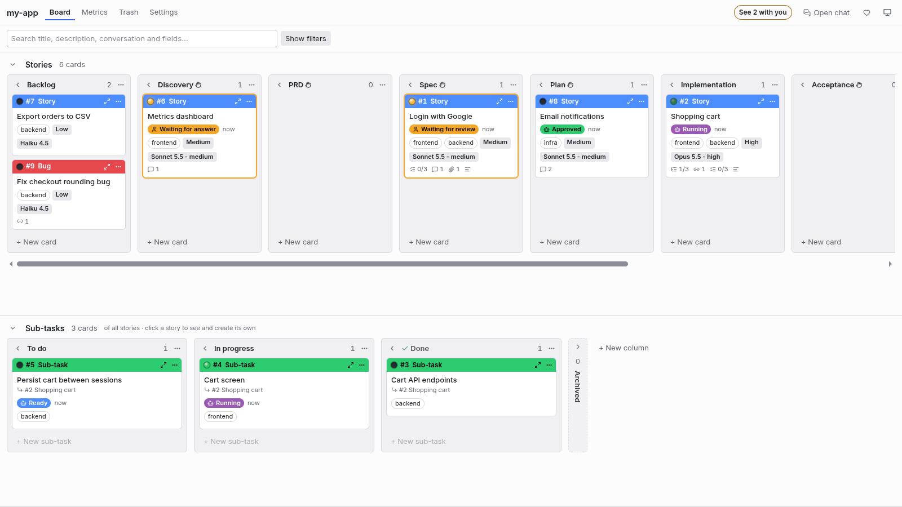
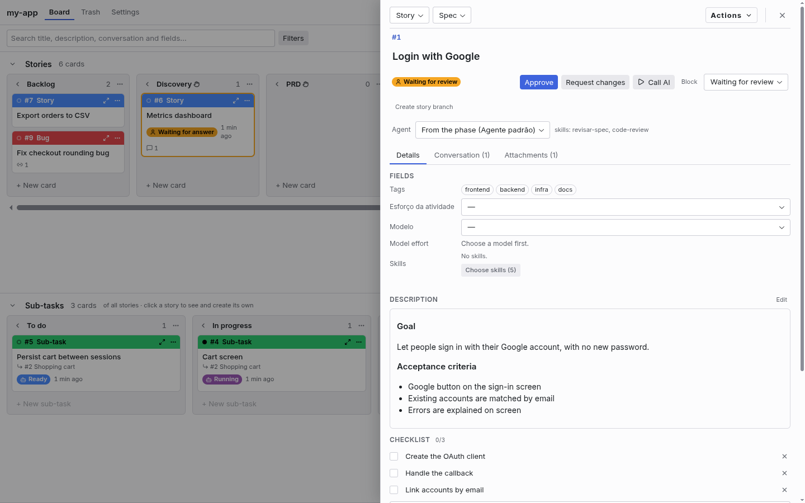
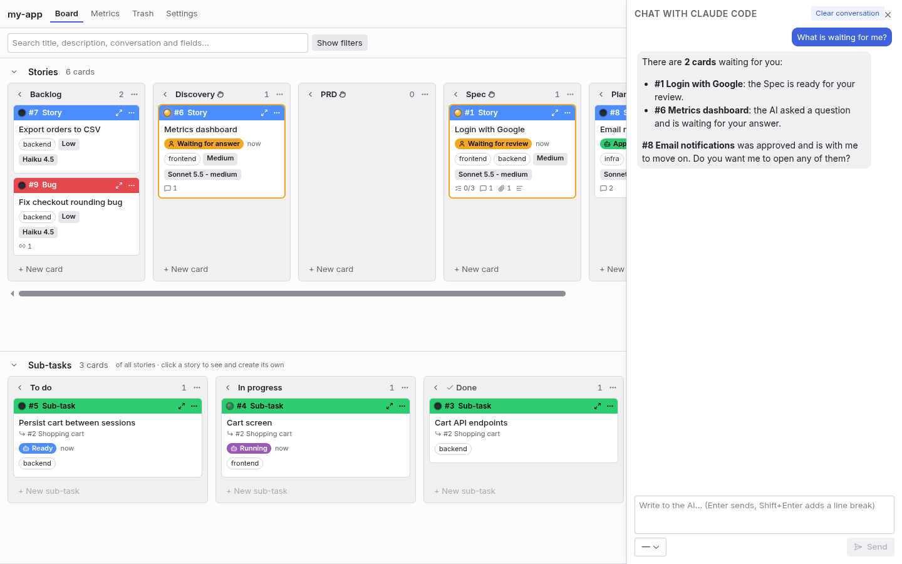
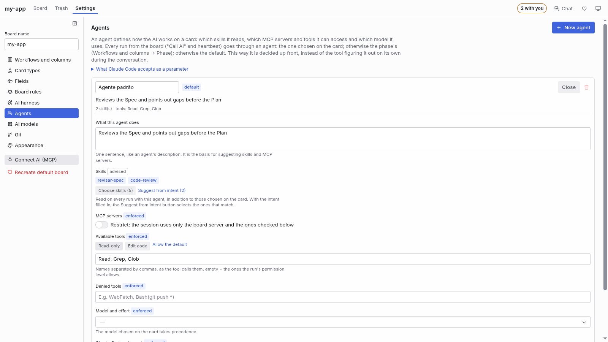
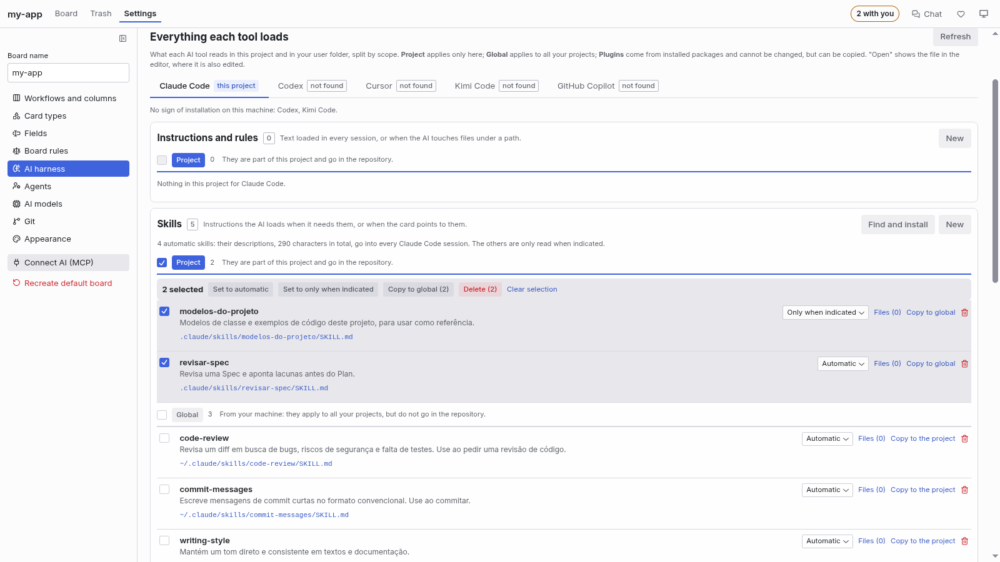
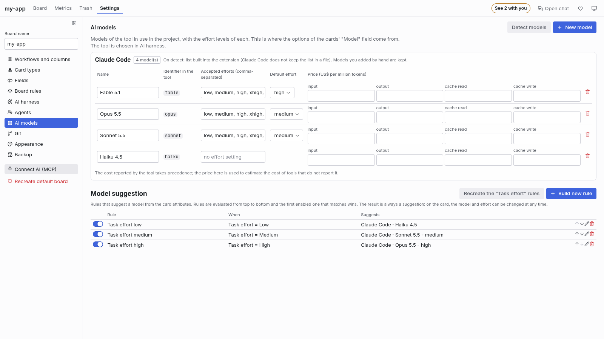

[🇧🇷 Português](README.md) · 🇺🇸 English


# Faz AI Kanban

> ⚠️ **Faz AI is in alpha.**
>
> The project is new and moves fast: a new version ships almost every week, and not everything has
> been tested on every AI tool and operating system. Bugs and unexpected behavior can happen, and
> screens, commands and the board format may still change from one version to the next.
>
> Use it freely, but with that in mind: review what the AI does before approving it, and do not rely
> on the board as the only record of something important. If something breaks or looks odd,
> [tell me in an issue](https://github.com/euclidesgc/faz-ai/issues): that is how it gets out of alpha.

> **Thank you to everyone downloading and trying it out.**
>
> I published the extension to the Cursor marketplace and went to sleep. When I woke up to install
> it on my work machine, it already had 160 downloads. I did not expect that, and it made my day.
>
> To each person who installed it, opened the board and gave a brand-new project a chance: thank
> you. You are the reason it keeps going.
>
> Faz AI is **completely free and open source** (MIT license), and contributions are welcome: tell
> me what worked and what did not, [open an issue](https://github.com/euclidesgc/faz-ai/issues) or
> [send a pull request](https://github.com/euclidesgc/faz-ai/pulls).
>
> Euclides G Catunda

> **Enjoying it? Help Faz AI grow.**
>
> A new project gets better with feedback from the people using it. If it has already saved you
> time, these one-minute gestures make a real difference:
>
> - ⭐ **Star the [GitHub repository](https://github.com/euclidesgc/faz-ai)**: it is the thing that
>   helps other people find the project the most.
> - 💬 **Rate the extension** in the store where you installed it, with stars and, if you can, a
>   couple of lines on what you thought: [VS Code Marketplace](https://marketplace.visualstudio.com/items?itemName=euclidesgc.faz-ai&ssr=false#review-details)
>   or [Open VSX](https://open-vsx.org/extension/euclidesgc/faz-ai/reviews) (Cursor's store).
> - 🐞 **Found a bug?** [Open an issue](https://github.com/euclidesgc/faz-ai/issues/new?template=bug.yml)
>   saying what you did, what you expected and what happened. The extension version and the editor
>   you use help a lot.
> - 💡 **Have an idea or a suggestion?** [Tell me in an issue](https://github.com/euclidesgc/faz-ai/issues/new?template=sugestao.yml):
>   missing flows, confusing screens and integrations you would like to see.
>
> Before opening one, take a look at the [existing issues](https://github.com/euclidesgc/faz-ai/issues):
> sometimes the idea is already there, and a 👍 on it helps decide what comes next.

A kanban board inside your editor (VS Code and Cursor), built to run Spec-Driven Development (SDD)
together with an AI. You organize the work into stories and sub-tasks; the AI reads the board,
produces the artifacts of each phase and moves the cards as it goes.

The extension speaks English and Portuguese (**Settings → Appearance → Language**, automatic by
default). This page keeps the Portuguese names you see in a Portuguese interface and gives the
English meaning next to them; in English, the default board's names (workflows, columns, card types,
fields and the default agent) are shown translated, and names you create or rename stay as you
wrote them.



## Getting started

In five minutes you have a task moving on the board, with the AI working on it.

1. **Install and open.** Install **Faz AI Kanban** in VS Code or Cursor (from the tool's own
   marketplace), open your project's folder and click the **Faz AI** icon in the sidebar. Each
   folder has its own board, already set up with the workflow phases.
2. **Connect the AI to the board.** In **Configurações → Harness de IA** (Settings → AI harness),
   pick the project's tool (Claude Code, Codex, Cursor, Kimi Code or GitHub Copilot). In the **Tudo
   que a ferramenta carrega** (everything the tool loads) tab, on that tool, click **Instalar (padrão
   da ferramenta)** (install, tool default) in the **Servidores MCP** (MCP servers) section and again
   in the **Skills** section, for the flow skill, which teaches the AI to drive the phases.
3. **Create the task.** In the **Backlog** column, click **+ Novo card** (new card), type the title
   (for example, "Login with Google") and press Enter. Double-click opens the card: describe what
   you want, in Markdown, and optionally pick the AI model and the skills it must read.
4. **Let the AI start.** Drag the card to **Discovery** and click **Trabalhar na fase** (work on the
   phase) on the card. The AI reads the card through the board, analyzes the problem and talks with you in the
   **Conversa** (conversation) tab. When it finishes, the status changes to **Aguardando
   revisão** (waiting for review): it is your turn.
5. **Review and move on.** Read the phase document, answer, or click **Aprovar** (approve) or
   **Pedir ajustes** (ask for changes). On approval the story moves on to **PRD**, **Spec**,
   **Plan** and **Implementação** (implementation), always with the AI producing and you approving.
   The implementation sub-tasks are born in the lower workflow and the AI completes them one by one.

For day to day: the **N com você** (N with you) counter at the top shows what is waiting for you,
the **Chat** lets you ask the AI, in natural language, to create and move cards, and the
**heartbeat** can call the AI by itself when something is pending with it.

### Why this saves context

The AI spends context on whatever it loads in every session. The board exists so it loads only what
is needed, at the right time:

- **Each card is a new, short session.** Instead of one long conversation that accumulates
  everything, the AI opens the card through the board (`get_card`), does that piece of work and
  stops. The history stays on the card, not in the context window.
- **Skills only when indicated.** An automatic skill puts its description in every session; marked
  **Só quando indicada** (only when indicated), it only enters the cards that ask for it. Under
  **Harness de IA → Tudo que a ferramenta carrega**, the board shows how many skills are automatic
  and how many characters of description they put into every session.
- **Agents that restrict.** An agent can allow only some MCP servers and tools, and the **clean
  session** drops your user-folder customizations: fewer tool definitions loaded for nothing (what
  Claude Code and Cursor enforce by parameter is in the [Agents](#agents) table).
- **Documents as attachments.** PRD, Spec and Plan stay attached to the story; the AI reads them
  when the card needs it, instead of getting them pasted into every message.
- **The right model for each task.** Suggestion rules and the model per card or per agent avoid
  using the most expensive model where a lighter one is enough.

The context saving of on-demand skills is documented for Claude Code and Cursor; for the other
tools, the documentation only says the AI stops invoking the skill on its own. The board does not
promise a percentage: it shows, in the inventory, what is being loaded.

## What it is for

- **Plan in phases.** The story columns are the phases of the flow: Backlog, Discovery, PRD, Spec,
  Plan, Implementação (implementation), Homologação (acceptance), Concluído (done) and Cancelado
  (cancelled). Each story breaks down into sub-tasks, which have their own flow: A fazer (to do),
  Em andamento (in progress), Concluído (done).
- **Tell the AI what to do in each phase.** Each column has an instruction for the AI and, if the
  phase produces a document (Discovery, PRD, Spec, Plan), the template for that document. In
  Discovery the AI analyzes the problem and talks to you before any requirement is written; in
  Homologação the story is only completed with your approval.
- **Work with the AI on the same board.** The extension exposes the board over MCP. Claude Code,
  Codex, Cursor, Kimi Code, GitHub Copilot or any other MCP client can read and edit everything the
  interface allows, and the changes show up on the board right away.
- **Know who has each card.** Every card the AI works on has a status: Pronto (ready), Em execução
  (running), Aguardando resposta (waiting for an answer), Aguardando revisão (waiting for review),
  Aprovado (approved) or Bloqueado (blocked). It shows whether the next move is yours or the AI's.
- **Review before the AI moves on.** In columns that require approval (Discovery, PRD, Spec, Plan
  and Homologação by default), the AI finishes the work, asks for review and stops. It only moves
  the card after you approve.
- **See what is waiting for you.** The "Com você" (with you) filter, the counter on the sidebar icon
  and an editor notification show when the AI asks for a review, asks a question or hits a blocker.
  The AI, in turn, asks the board what is waiting for it.
- **Tell the AI how to run each card.** Each card can name the model, the effort level and the
  required skills. The model can be suggested by rules based on the size of the task.
- **Decide beforehand what the AI uses.** An agent sets the skills, MCP servers, tools and model for
  each phase or card, instead of letting the tool figure it out during the conversation. Every run
  started by the board goes through an agent.
- **See and configure the whole harness.** For each AI tool installed, the board shows what it
  loads (instructions, skills, subagents, commands, hooks, MCP servers, plugins and settings), split
  between the project, your user folder and plugins.

## How to use it

1. Open a folder in the editor and click the **Faz AI** icon in the sidebar. Each folder has its
   own board.
2. Create stories with **+ Novo card** (new card) and drag them between columns. Clicking a story
   shows only its sub-tasks; double-click opens the details.
3. The card details hold the status, the description in Markdown, the fields, the checklist, the
   sub-tasks, the conversation and the attachments. The conversation is where you and the AI talk
   about the card. Phase documents (PRD, Spec, Plan…) are built in sub-tasks but stay attached to
   the story; in sub-tasks they appear as links.
4. Search by text or by ID (`#12`). The **Filtros** (filters) section of the sidebar filters by
   type, fields, dates and relationships.
5. Cards can be archived (the "Arquivados" column at the end of each row) or sent to the **Lixeira**
   (trash), from where they can be restored.



By default, a story is not completed and does not advance a phase while it has open sub-tasks of
that phase. These rules can be turned off in the settings.

At the top of the board, **N com você** (N with you) shows how many cards are waiting for your
review, answer or unblocking (one click filters to them), and an indicator appears while the AI is
working on a card.

Each card has a bar in its type's color, with the ID, the type and the open and actions buttons.
Below it come the title (in full in the tooltip when it doesn't fit), the status with an icon for
who the next step is waiting on (a robot for the AI, a person for you) and how long it has been
like that, the fields, the AI model (e.g. "Sonnet 5.5 - baixo", with the effort in Portuguese) and,
in the footer, the counters, the branch and the PR. Cards waiting on you get a border in the
status color, and the LED on the bar tells the card's state at a glance: green and blinking slowly while the AI is working on it (on a story, also when it works on one of its sub-tasks), yellow when it is waiting on you, red when it is blocked, and off when nothing is happening.

### Links between cards

Besides sub-tasks, any card can be linked to another one, in any workflow, under **Vínculos**
(links) in the open card (as in Kanbanize or Businessmap): **parent**, **child** or **related**.
Search the other card by number or title and pick the kind of link. The card footer on the board
shows the link and, when there are children, how many are already closed. A repeated link and one
that would close a cycle (the parent already being a child of the card) are refused.

A linked parent follows the rule in Configurações → Regras: when the last open child enters a
completion column, the board asks (or moves on its own, depending on the rule) whether the parent
should also go to completion. The AI uses the `link_cards` and `unlink_cards` tools, and `get_card`
returns the links.

The **Vínculos** section also shows, display-only, the sub-task relation: on a sub-task, a "Pai"
(parent) group with the story; on a story, the sub-task count with a shortcut to the
**Sub-tarefas** section. This relation is read-only (no remove button) and does not enter the
completion rule above, which still applies only to the manual parent/child link.

#### Dependencies and sub-tasks in parallel

A card can **depend** on another: in **Vínculos**, pick "precisa terminar antes deste card" (the
other one is a prerequisite) or "só começa depois deste card". The open card shows the groups
**Depende de** (depends on, with how many dependencies are still open) and **Libera** (unblocks).
The board refuses a dependency cycle.

The AI uses this to speed up Implementation. In Plan it declares the order between sub-tasks
(`create_card` with `depends_on`, or `link_cards` with `depends_on`): one depends on another when it
uses what the other produces or when both change the same files. In Implementation, the story's
`get_card` returns in `subtasksNow` what can run now, and the AI delegates **the sub-tasks with no
pending dependency to simultaneous subagents**, each with its card's model; at the end of the round
it verifies the whole, commits and moves on to the next round. `start_work` refuses a sub-task that
is still waiting for another. With no dependencies declared, all open sub-tasks are considered
independent. It depends on the AI tool having subagents (Claude Code does); without them, execution
goes one at a time, in dependency order. Projects that already had the flow skill installed keep its
old text (the board does not overwrite a skill you may have adjusted): delete it and install it
again in the settings to get the new instruction.

### The board in the browser, outside the editor

The board does not depend on the editor window:

- **Abrir no navegador** (open in browser, at the top of the board, or the command **Faz AI:
  Abrir board no navegador**) opens the same board in a browser tab. The editor stays open and
  keeps the board; both screens stay in sync.
- **Without the editor**: run `~/.faz-ai/bin/faz-ai` in the project folder (or `faz-ai <folder>`).
  It serves the board in the browser, with the MCP server, AI runs and the heartbeat, and keeps
  running until you stop it with Ctrl+C. The launcher is created by the extension and uses the same
  data; it needs Node.js on the PATH. To call just `faz-ai`, add `~/.faz-ai/bin` to your PATH.
  `faz-ai --help` lists the options (`--port`, `--data`, `--no-open`).

The page only answers on `127.0.0.1` and requires the secret in the link opened by the editor or
the terminal (it is then kept in a cookie, so the address can be bookmarked). The "Sistema" theme
follows VS Code's light or dark mode in the editor and the operating system's in the browser,
always with the board's own colors. In the browser, the filters open in the board's own bar. A
board is served from one place at a time: with the editor open on the folder, use **Abrir no
navegador**; the terminal `faz-ai` warns and does not start.

## Using it with AI

1. In Configurações (settings) → **Harness de IA**, choose the project's tool (Claude Code, Codex,
   Cursor, Kimi Code or GitHub Copilot).
2. In the **Tudo que a ferramenta carrega** (everything the tool loads) tab, pick the tool and, in
   the **Servidores MCP** (MCP servers) section, click **Instalar (padrão da ferramenta)** (install,
   tool default). The board registers the `faz-ai` server in the global file the tool reads.
3. In the **Skills** section of the same tool, click **Instalar (padrão da ferramenta)** for the
   flow skill (`faz-ai-fluxo`): it teaches the AI to take cards through the phases, write the
   documents, ask for review and pick up pending work. It can be edited.

**Global or this project.** Both items live only in their section, on each tool, each with two
buttons:

| | Where it writes | When to use |
|---|---|---|
| **Instalar (padrão da ferramenta)** (tool default) | global config: `~/.claude.json` (through `claude mcp add --scope user`), `~/.cursor/mcp.json`, `~/.codex/config.toml`, `~/.kimi-code/mcp.json`, `~/.copilot/mcp-config.json`; the skill in `~/.claude/skills`, `~/.cursor/skills` and equivalents | recommended: the board works in any repository opened with it, with no file in the project |
| **Instalar neste projeto** (this project) | `.mcp.json`, `.cursor/mcp.json`, `.codex/config.toml`, `.kimi-code/mcp.json` or `.vscode/mcp.json`; the skill in `.claude/skills`, `.cursor/skills` and equivalents | pinning a version in a repository or a fork, or a skill tailored for the team |

The global registration does not pin the project folder: Cursor and VS Code get
`${workspaceFolder}`, which the editor replaces with the open folder; Claude Code passes the folder in
the `CLAUDE_PROJECT_DIR` variable; in the others, the board's bridge finds the board by walking up
from the folder the tool was opened in. In GitHub Copilot, the global registration covers the Copilot
CLI and, in VS Code, the editor profile's `mcp.json`. In Cursor, after installing, the banner asks
you to **reload the window** (the Cursor chat only loads the server that way); check in Cursor
Settings → MCP that `faz-ai` is on. The project one takes precedence over the global
one in that project, so installing in the project when a global one exists asks for confirmation,
and so does replacing a flow skill that already exists at the destination (changes made to it are
lost). The **Faz AI: Install the board MCP (global)** palette command does the default install on
the project's tool, and the MCP tool `install_flow_skill` takes `scope` (`user`, the default, or
`project`).
4. Open a new session of the tool in the project folder and ask, for example, "list the cards on
   the board", "take story #1 and write the PRD" or "check what is pending on the board and move it
   forward".

While something is missing for the board to work with the tool, a yellow bar stays at the top of
the board, on every screen, and in the chat panel. It checks Node.js (the board's server runs on
it), the tool's command line, its sign-in (for Cursor, through `cursor-agent status`), the board's
server registration in the file the tool reads (for Claude, the registration for your user from
`claude mcp add -s user` also counts), a registration pointing to a node or path that no longer
exists, to another folder or to the bridge of an earlier version, and the permission level. Each
item says what it affects and brings the action: the command to copy, **Instalar o MCP do board**
(install the board MCP, which opens the tool's MCP servers section), **Corrigir o registro** (fix the
registration: a broken one in the project file takes precedence over the global one; fixing removes
it from there and leaves the global one in effect), **Recarregar a janela** (reload the window) or
the shortcut to the AI harness. The bar has no close button: it goes away on its own when the last item is solved. The
check runs when the board opens, when the tool or permission changes, after connecting, every 5
minutes and on **Verificar de novo** (check again), which also rereads the terminal PATH (a node
installed with the board open is found without reloading the window), and says when nothing
changed.

For Claude and Cursor, an unregistered board server shows as **recommended**, out of the count:
runs from the board carry the server on their own, and the registration is only missing for the AI
to see the board in your conversations outside it. On its own, that item becomes a discreet line
instead of the bar. While the command line is missing or not signed in, the card's AI buttons are
disabled, with the reason in the tooltip.

Suggested flow: the AI reads the story and the phase instruction, creates a sub-task to build the
phase document, attaches the document to the story and asks for review in the card's conversation.
You answer on the card itself:

- **Aprovar** (approve) marks the card as approved, and the AI takes it to the next column.
- **Pedir ajustes** (request changes) sends the card back to the AI with your text in the
  conversation.
- If the AI asks a question, the card waits for an answer; once you reply in the conversation, it
  goes back to the AI.
- **Bloquear** (block) records a blocker, with the reason.

### Chat with the AI



To give the board orders in natural language, use the **Chat**: in the editor's sidebar, the **Chat
com a IA** section (below Board and Filtros); in the browser, the **Chat** button in the top bar,
which opens a panel on the right. Write, for example, "create a Login with Google story and three
sub-tasks" or "what is waiting for me?". The project's AI answers and acts through the board tools:
it creates, moves and links cards, and queries what is on it. Below the field you pick the **model
and effort** for the next messages (the choice is remembered). Enter sends, Shift+Enter adds a line,
**Parar** (stop) interrupts and **Limpar** (clear) erases the conversation. The history is kept per
project.

The chat uses the same background run as the cards, so the limit under Configurações → Harness de
IA → "O que a IA pode fazer" applies (by default, the board only), and so does the time limit there.

### Work on the phase and Refine with AI

A card has two buttons that run the project's tool in the background. It is not a live chat: the
answer arrives as a message in the conversation when the run ends, and meanwhile the card shows "Em
execução" (with a **Parar** button to stop it).

- **Trabalhar na fase** (work on the phase) does the work of the column the card is in, the same as
  the heartbeat would: in Discovery it analyzes the problem, in PRD it writes the PRD, in
  Implementação it writes the code (if the permission allows). It reads the conversation and answers
  it, and ends by handing over: asks for review, asks a question, blocks or moves the card. If Tags,
  Esforço da atividade, Modelo and Skills are all empty, it fills them first. It is in the card
  header and in the conversation (with text typed, **Enviar e trabalhar na fase** sends the message
  first).
- **Refinar com IA** (refine with AI) only makes the card clear and complete for whoever will work
  on it: rewrites the title and description (without inventing requirements; whatever is ambiguous
  becomes a "Dúvidas em aberto" list), reviews Tags, Esforço da atividade, Modelo and Skills even if
  they already have a value, and adds the missing steps to the checklist. It does not work on the
  phase, create sub-tasks, move the card or touch files: it runs with the board only (in Kimi, which
  lacks that level, the request forbids touching files). At the end it summarizes in the conversation
  what changed (with the previous description, if it rewrote it) and the card returns to the status
  it had, also when the run fails: the failure goes to the conversation, without blocking the card. A
  refine does not count as a run without progress for the autonomous mode.

Images pasted into the message become card attachments and the AI receives them.

- What the AI may do in these runs is set in Configurações → Harness de IA → **Execução pela
  conversa**: only the board (default), the board and project files, or no restrictions. The level
  in use is shown next to the button, with a shortcut to change it. The AI is told about the limit:
  if the work needs more than the level allows, it blocks the card saying which option to choose.
- Kimi Code, when running in the background, only works at the "no restrictions" level. Cursor
  accepts all three: at "only the board" and "board and files" its session gets only the tools of
  that level (reading and MCP; reading, MCP and editing), with no terminal.
- The tool must be installed and signed in. Its CLI does not need to be on the PATH: the board also
  looks in the usual install folders and inside editor extensions (if you only use the Claude Code
  or Codex extension, you already have the executable). Cursor's CLI is `cursor-agent` (the
  `curl https://cursor.com/install -fsS | bash` installer also creates the `agent` shortcut); sign in
  once with `cursor-agent login`.
- With Claude Code, the board's server is passed on the command line of each run: it does not
  depend on installing the MCP or on approving `.mcp.json`. With Cursor, the board uses the global
  registration in `~/.cursor/mcp.json` when it leads to this board; without it (or in a worktree
  outside the project folder), it writes the server to `.cursor/mcp.json` before running (and adds
  the file to `.git/info/exclude` when it creates it). For the other tools, install first.
- When the story has its own working folder (worktree), the tool gets that folder along with the
  project's, Cursor included.
- Stop and the time limit end the tool and everything it started (MCP servers, tests, commands).
  Claude Code does not run "no restrictions" as root (containers, WSL as root): the board warns.
  Without Node.js on the PATH, the board server runs with the editor's own runtime.
- If the run fails or exceeds the time limit, the card becomes blocked, with the reason and the end
  of the tool's output. The full log is in the **Output → Faz AI** panel (or in the `faz-ai`
  terminal).

### Consumption, cost and inventory of each run

Every time the AI runs (from the conversation, the heartbeat or autonomous mode), the board records
in the database what the run consumed: input tokens, output tokens, cache read tokens and cache
creation tokens, the cost in dollars, the number of turns and the tool's session id. It also
records the **inventory** of what the AI used: native tools, MCP tools (with the server of each
one), subagents and skills, with the number of calls.

- **Cost comes from two sources.** When the tool reports the cost, the board stores that value.
  When it does not, the board estimates it: tokens multiplied by the model's **price per million
  tokens**, which you fill in under Configurações → **Modelos de IA** (Settings → AI models; four
  prices: input, output, cache read and cache creation) or through MCP with `upsert_model`. An
  estimated cost is always marked "(estimado)". A model without all four prices gets no calculated
  cost: the value stays blank, never 0.
- **In the log channel** (**Output → Faz AI**), the tool's output appears as readable lines, and at
  the end of each run a summary line follows with input, output, cache read and cache creation,
  turns and cost, for example `Consumo: 1.250 entrada · 3.400 saída · 52.000 leitura de cache · 9.100
  criação de cache · 8 turnos · US$ 0,4210 (estimado)`. Turns and cost are left out when the tool
  does not report them. The line is written in Portuguese, as the board's log channel is.
- **Copilot has no measured consumption.** It has no structured output, so its runs are recorded,
  but without tokens, cost or inventory. Wherever you see "não medido" (not measured), this is why:
  missing measurement, not zero consumption. The same applies to runs that end before the tool
  reports consumption.
- **Questions in the board chat** are recorded too, with no card attached.
- **The detail of each run is kept for a window you configure**, from 1 to 24 months (the current
  month plus the earlier ones). The default is 6 months. After the window the detail is discarded,
  but the **monthly totals never expire**. It used to be 12 months; the shorter default keeps the
  database file within its size limit. Where to change it, and what happens when you lower it, is
  under **Metrics panel**, right below.

### Metrics panel

The **Métricas** (Metrics) button, the fourth in the top navigation (Board, Metrics, Trash,
Settings), shows what the board recorded about the work and the AI's usage. It works in the editor
and also in the board opened in the browser.

- **Filters.** The period can be Hoje (today), 7 dias, 30 dias, Este mês (this month), Últimos 12
  meses (last 12 months), Tudo (all) or a free range (start and end date). The **Workflow** filter
  limits the numbers to one workflow, and **Limpar filtros** (clear filters) goes back to the
  default. Below the controls the panel writes the period it queried.
- **Five totals.** Completed activities (cards that reached a completion column), AI runs, tokens,
  cost and AI time. **AI time is the sum of each run's duration**: simultaneous runs add up, so the
  total can exceed the elapsed clock time. What was not measured shows as "não medido" (not
  measured), never as 0, and when only some of the runs were measured the note says how many were
  left out.
- **Cost and tokens per month.** A bar chart, one series at a time (the **Custo** / **Tokens**
  switch). The month in progress is hatched, because it has not ended yet; a month with no data at
  all is a gap marked "sem dado" (no data), not a zero-height bar. Below the chart a table has the
  same numbers and a notes column (partial, no data, monthly total only).
- **Where the usage happened** ("Onde o consumo aconteceu"). The period's usage split by **phase,
  card type, model, AI tool, effort or profile** (the **Recortar por** / break down by selector), as
  horizontal bars in the measure chosen in **Medida da barra** (bar measure): cost, tokens, runs or AI
  time. The table with the four measures sits beside it. Categories past the limit add up in an
  "others" row. It reaches the whole series of the period, including months already archived.
- **How long a card stays in a phase** ("Quanto tempo o card fica na fase"). One row per phase with
  the permanences, the median, the mean, the unknown ones and how many cards are in it now. They are
  permanences, not cards: a card that returns to the phase counts twice. It is clock time, unlike the
  AI time of the phase breakdown.
- **Lead time.** From the card's creation to its **first** completion, for cards completed in the
  period: the median in front, the mean, how many were counted, how many are unknown and the
  sortable list per card. Unknown is a card whose creation date is not in the detail kept (the month
  was discarded or the card predates the log); the date is not estimated.
- **Most expensive phases and Most expensive cards** ("Fases mais caras" / "Cards mais caros"). Two
  rankings side by side, in tables you sort by cost, tokens, runs or AI time by clicking the header
  (or with Enter/Space). The default is cost when the period has measured cost and AI time when it
  does not, and the screen writes the criterion in force. Phases reach the whole series; cards, only
  the detail kept, and each block says so.
- **What the AI used** ("O que a IA usou"). Tools, MCP tools (with the server in its own column),
  subagents and skills, with the number of runs and uses. "Not measured yet" (no run recorded an
  inventory) is different from "no records in the period".
- **Tokens and cost.** Tokens count even when the model has no price configured; cost adds up only
  the runs that have a price, and the note says how many were left out. Before the board measures
  consumption, cost and inventory show as "não medido" (not measured) and almost every lead time as
  unknown: that is the expected behavior, not a failure.
- **Detail kept** ("Detalhe guardado"). Shows the retention window for the runs' detail and how much
  space it takes. You can set it from 1 to 24 months (default 6). Raising it saves right away.
  **Lowering it asks for confirmation**, which says how many months lose their detail, and the
  discard only happens the next time the board opens. The monthly totals stay. The field saves when
  you press Enter or leave it. The times and the inventory read only the detail kept: a discarded
  month leaves those blocks.
- **Honesty notes**, always next to the number: since when the board's log exists (before that
  there is no data, the number is not small); the note that the requested period was cut at the
  start of the log; and the months that only have the monthly total (they enter the series, but with
  no breakdown by dimension and no detail per card). With a workflow filtered, a month consolidated
  before the log stored the workflow is left out of the numbers, and the note says so.

### Usage metrics with get_metrics

During a card's conversation, the AI can query aggregated statistics from the board's history — usage,
duration, and cost of runs — without opening any panel. Call the `get_metrics` tool in natural language:
"how much AI time did card #72 use?", "which card type uses the most this month?", "which agent was
used most?". The tool replies with a compact table, optimized to save tokens.

- The aggregation can group by phase (`phase`), card type (`card_type`), AI tool (`tool`), model
  (`model`), effort (`effort`), profile (`profile`), card (`card`), agent (`agent`), skill (`skill`),
  used tool (`used_tool`) or MCP tool (`mcp_tool`). Omit to get only the period's total.
- `tool` and `used_tool` are not the same thing: `tool` is the AI tool that ran (claude, codex);
  `used_tool` and `mcp_tool` are what the run used (Read, Bash, `get_card`). In `mcp_tool` the server
  comes in its own column, or "servidor não registrado" (server not recorded) when the name did not
  carry it.
- Period filters (start and end date, in `YYYY-MM-DD`), card (e.g. `72` or `#72`), and dimensions
  (e.g. phase, model, card type).
- On the **agent**, **skill**, **used_tool** and **mcp_tool** dimensions the table shows only the
  count of runs and uses (no tokens or cost, which cannot be split among a run's components).
  `effort` and `profile` have tokens and cost.
- Tokens count even when the model has no price configured; cost comes only from runs that have a
  price.
- The panel's times (permanence per phase and lead time) are not in `get_metrics`.
- Unmeasured values appear as "-" (never 0), for example Copilot runs. A cost estimated from the
  model's price is marked as estimated.
- Always tells you when the board's history started and which periods have only monthly totals
  (without per-run detail). Periods outside the retention window (6 months by default) have no detail and aggregate only
  the already-consolidated totals.

### Branch and working folder per story

Each story works on its own branch, created by the board (for example
`historia/12-login-com-google`). By default it comes with a worktree: a separate working folder,
next to the project, where the AI changes the code without touching your folder or your work in
progress. Sub-tasks commit to the story's branch.

- The branch is created when the AI starts the implementation (it calls `prepare_workspace`) or with
  the **Criar branch da história** (create the story's branch) button on the card.
- The card shows the branch and opens the working folder in a new window.
- Configurações → **Git** holds the mode (worktree, branch in the same folder, or off), the branch
  name pattern, the worktrees folder, automatic PR merge when approving acceptance, and automatic
  merge detection, with the archiving of already published stories (on by default).
- Each worktree is a working copy: dependencies have to be installed in it.

### Pull request and merge in Homologação

In Homologação the AI pushes the branch, opens the story's pull request, records its address on the
card and asks for your review. The card shows the PR link.

Automatic merge is optional and starts turned off (Configurações → Git). With it on, when you
approve a story that is in the last column before completion:

1. the board merges the PR through the GitHub CLI (`gh`), with the configured method (squash, merge
   or rebase);
2. only after the merge the card goes to Concluído, and the story's working folder is removed;
3. if the merge fails (conflict, required checks, no access), the card becomes blocked with the
   error and stays in Homologação.

The merge does not happen if the story has no PR recorded or still has open sub-tasks. With
automatic merge off, approving only marks the card, and the AI moves it to Concluído.

### Automatic merge detection

The board can watch a delivered story's pull request and detect when it is merged, concluding the
story automatically. The feature starts on (Configurações → Git, **Concluir a história quando o
pull request for mergeado**). A periodic routine checks the PR state at a configurable interval
(**Verificar a cada (minutos)**, default 15, range 5 to 1440). When the merge is detected:

1. the board records the merge commit on the card;
2. registers in the conversation that the story was completed;
3. moves the card to Concluído and removes the working folder.

If the pull request is closed without a merge, the board registers a warning in the conversation
once only. The merge is still done by the person, manually or through automatic merge; the board
only observes. Failures in querying the PR state (no network, no authentication, no `gh`
installed) do not block anything — the warning appears in the log, and the routine keeps trying at the next interval.

In the same round, after looking at the pull requests, the board takes the last step of the cycle:
**when the version containing a concluded story is published, it records in the conversation which
version carried it (tag and release link) and archives the card**. That way the Concluído column
holds only what is merged and has not reached your users yet; what was already delivered goes to the
workflow's archived area, from which you can unarchive it at any time. There is nothing to turn on:
the step comes along with merge detection, on the same interval and the same switch, and it is on by
default with it.

A story counts as published when there is a tag that **contains** the merge commit **and** that has a
**published release** on GitHub — which is what this project's `npm run release` creates. A tag
without a release does not count, a draft release does not count, a prerelease does. The recorded
version is the oldest among those containing the commit, by publication date. The criterion is
deliberately conservative: archiving late fixes itself on the next round, archiving early hides a
card with nobody noticing.

Everything here is best effort. A project with no releases, outside GitHub or on a machine without
`gh` simply archives nothing: no card is blocked and the reason appears once in the log. The board
never publishes a version — it only reads what you published — and stories concluded before this
version, which have no merge commit recorded, stay yours to archive with one click.

### Heartbeat

With the heartbeat on (Configurações → Harness de IA), the board calls the AI on its own at every
interval, while the editor is open in the project folder. In each round it advances approved cards,
answers pending messages and works on ready cards, one story at a time. In "Worktree por
história" mode, **Tocar histórias em paralelo** (drive stories in parallel; on the same screen, off by
default) makes the heartbeat drive several stories at once, each in its own working folder: two by
default, up to six in **Histórias ao mesmo tempo**; the limit
counts every run in progress, including the ones called by hand. Outside that mode, and in
autonomous mode (whose stories are stacked), it stays one at a time, and the field is disabled. The
Git screen explains why in each mode: with a branch in the project folder, two stories at once would
switch the branch under each other and mix their changes; with worktrees they are isolated, at the
cost of one more copy of the files on disk per story (with dependencies installed in each) and more
memory and CPU while several AI sessions, tests and builds run together.

- With nothing pending for the AI, nothing runs.
- The round follows the board order: bugs first, then top to bottom — what decides is the card's
  position, not its number nor what has already been approved.
- Cards that are with you (waiting for review or an answer, blocked) are not touched, unless you
  left an unanswered message in the conversation.
- **Rodar o heartbeat agora** (run the heartbeat now), in the settings or with the command **Faz AI: Rodar o heartbeat
  agora**, starts a round right away, even with the heartbeat off. **Faz AI: Parar as execuções da
  IA** stops everything.
- The status bar shows the cards being run and the time of the next round.
- The **heart** at the top right of the board shows the heartbeat: red and beating while it is
  running; grey and still when it is off or cannot run (no connection to Faz AI, or no tool).
  Clicking it turns the heartbeat on and off.
- Runs use the same permission and time limit as the "Trabalhar na fase" button.

Which columns require approval, and in which ones the AI works, is set in Configurações → Workflows
e colunas. You can always move any card yourself without approval.

### Autonomous mode (YOLO)

A **story** can be marked **YOLO**: in the card panel, turn on **Modo autônomo** (the board
asks for confirmation, because the mode gives up every approval). From then on the AI drives the
story by itself, **without asking for authorization or confirmation on anything**:

- From **Backlog** to the last column the AI works in (Homologação, on the default board): it does
  Discovery, PRD, Spec and Plan, creates the sub-tasks, implements them one by one and, in that
  last column, opens the pull request, records it with `set_pull_request` and stops there — the
  story waits for your review. Columns that require approval stop holding the card, and the AI's
  review request becomes an approval right away, with its summary recorded in the conversation.
- **No questions**: the AI does not use `ask_question`; faced with a doubt it decides and records
  the decision and the reason in the conversation. Only a real impediment (access, environment, a
  failure it cannot fix) blocks the card.
- **No merge**: the AI stops at the last column it works in, with the pull request open; merging and
  moving the card on to Concluído stay with you. Concluído means merged.
- **No restrictions**: in the mode's runs the AI uses the "Sem restrições" permission (edits files
  and runs commands), because it needs git and `gh`. Turning the mode on accepts this for the story.
- **Queued and stacked**: the **autopilot** drives autonomous stories one at a time, in board
  order — bugs first, then top to bottom — and moves on to the next story in the queue as soon as
  the current one is delivered (stopped at the AI's last column, with the pull request recorded),
  without waiting for your review or the heartbeat interval. Each story's branch starts from the branch of the
  closest lower-numbered story that already has one, and its pull request is opened with `--base`
  on it, forming a stack of PRs; when the board order runs a story before a lower-numbered one, its
  branch starts from the main branch and its pull request stands alone, outside the stack.
- **Splitting a large request**: the AI can create the following stories from an autonomous story
  (`create_card` with `autonomous_from`). They are born autonomous, join the queue, and get a
  **related** link to the origin story (skipped silently if any link already exists between the
  two). It never turns the mode on for a story you did not turn on.
- **Brakes**: the autopilot stops when the AI blocks the card or when a run fails (the card is
  Bloqueado, with the reason), and blocks the story after 3 consecutive runs that advanced nothing.
  Once you unblock the card it carries on by itself.

The **autonomous mode button** at the top of the board shows while there is a story in the queue
and says what the click does: **Pausar modo autônomo** (pause; lit, with the autopilot driving;
pausing interrupts the AI) or **Retomar modo autônomo** (resume; dimmed, paused). From the editor: **Faz AI: Pausar o modo autônomo (YOLO)**, **Faz AI: Retomar o modo
autônomo (YOLO)** and **Faz AI: Parar as execuções da IA e o modo autônomo**. When the editor
opens the autopilot does not start by itself: it starts when you turn the mode on for a story or
resume. The heartbeat does not drive autonomous stories; they belong to the autopilot.


### Agents



An agent (Configurações → **Agentes**) says how the AI works on a card: which skills it reads, which
MCP servers and tools (available and denied) it can use, which model and effort, and whether the
session is clean (without your user-folder customizations and without automatic skill invocation).
Every run started by the board goes through an agent: the one chosen on the card; otherwise the
phase's (Workflows e colunas → Fase); otherwise the board default. The board always has at least
one, the **Agente padrão** (default agent), which restricts nothing.

To configure without knowing every skill or tool:

- **O que este agente faz** (what this agent does): one sentence of intent. With it, the **Sugerir
  pela intenção** (suggest from intent) button selects the skills (and MCP servers) whose name or
  description match. The suggestion is word-based, local and does not call an AI; you confirm what
  stays.
- **Skills**: the same picker window as the card, with search, origin tabs and checkboxes.
- **Tools**: ready-made sets (**Só leitura** read-only, **Editar código** edit code) and an editable
  list.
- **Tool subagent**: optional, an agent file of the tool itself (for example
  `.claude/agents/reviewer.md`) to drive the session.

Each run started by the board ("Trabalhar na fase", "Refinar com IA" and the heartbeat) is a new session, with only what is
on the card. The agent becomes command-line parameters where the tool accepts them; the rest goes
into the prompt, as instructions:

| Tool | Enforced by parameter | Advised only |
| --- | --- | --- |
| Claude Code | subagent, MCP servers, tools, model and effort, clean session | skills |
| GitHub Copilot | subagent, MCP servers, tools, model and effort | skills, clean session |
| Kimi Code | subagent, model | skills, MCP servers, tools, clean session |
| Codex | MCP servers, model and effort | subagent, skills, tools, clean session |
| Cursor | model | everything else |

Skills are always passed by file path. In a conversation you open yourself, the agent reaches the
AI through `get_card`, as guidance.

## AI harness



Configurações → **Harness de IA** holds everything the AI tools load, in three tabs: **Ferramenta e
execução** (tool and run: the project's AI and how the board calls it), **Do projeto** (from the
project: the rules file, skills and agents that are part of the repository, editable there) and
**Tudo que a ferramenta carrega** (everything the tool loads). In the last one, under **Tudo que
cada ferramenta carrega** (everything each tool loads), there is one tab per tool with eight sections (instructions
and rules, skills, subagents, commands and prompts, hooks, MCP servers, plugins, settings and
permissions), each split into three scopes:

- **Projeto** (project): files in this folder; they apply only here and go into the repository.
  This group is always shown, highlighted, and says when the project has nothing of that kind.
- **Global**: files in your user folder (`~/.claude`, `~/.codex`, `~/.copilot`…); they apply to all
  your projects. Every change to them asks for confirmation.
- **Plugins**: they come from installed packages; the board does not change them, but they can be
  copied.

What you can do:

- **Read the list effortlessly.** Each item shows its name, the description as a hint (capped at
  two lines) and, on its own line, the full path of the file. Clicking the path opens the file in
  the editor, which is also where it is edited.
- **Act on many at once.** Each row has a checkbox, and the header one selects the whole group.
  With items selected a bar appears: make skills automatic or only-when-indicated, copy to the
  project or to global, and delete, always with confirmation.
- **Create** an item in the place and format the tool expects, **delete** it, and **copy** skills,
  subagents, commands and rules from global or from a plugin into the project (and from the project to
  global).
- **MCP servers**: add and remove them, in each file's format.
- **Hooks and permissions**: add and remove hooks and allow, ask and deny rules.
- **Find and install skills** from a folder or a git repository: the board lists the skills it
  finds and copies only the ones you pick. Nothing from the repository is executed.

### On-demand skills

Each skill has a mode:

- **Automática** (automatic): the AI sees the description in every session and decides when to use
  it.
- **Só quando indicada** (only when named): the AI does not invoke it on its own; it applies when a
  card names it or when it is called by name.
- **Desligada** (off, project only): the tool does not see it, but a card can still name it.

The card's "Skills" field shows a summary of what is selected and opens a window to choose: search
by name or description, **Todas / Marcadas / Projeto / Globais / Plugins** tabs (all / selected /
project / global / plugins) and one checkbox per skill, with its origin in view. It works with
hundreds of skills. The card hands the AI the file
path of each skill, so a skill does not need to be visible to the tool to be used. That lets you
keep many skills available without filling the context of every session. The context saving is
documented for Claude Code and Cursor; for the other tools, the documentation only says the AI
stops invoking the skill on its own.

To avoid ticking skills card by card, set them on the type: in Configurações → **Tipos de card** →
**Padrões por tipo** (defaults per type), the "Skills" field (and the model) come pre-filled on
every new card of that type. Each card can still change them.

### Templates and references

Class templates and code examples live inside the skill's folder (`references/`, `assets/`,
`scripts/`). Each skill's **Arquivos** (files) button lists, creates and deletes those files, and
**Criar skill de modelos** creates a project skill meant for them. A card that names the skill
receives the paths of its supporting files.

The editor has to be open in the project folder for the AI to reach the board. Manual registration,
each tool's formats and troubleshooting are in [docs/mcp.md](docs/mcp.md) (in Portuguese).

## Settings



| Section | What it adjusts |
| --- | --- |
| Workflows e colunas | As many workflows as you want (independent cards or sub-tasks), with editable names and a position you change by dragging; **Nova coluna** (new column) on each one; names, order (drag) and meaning of the columns; where the AI works and which ones require approval; each column's phase (AI instruction and document template). Opening and closing workflows and columns happens on the board itself and is remembered |
| Tipos de card | Story, Bug, Sub-task…, with color and default field values per type |
| Campos | Custom fields (text, select, date, model…) and where they appear; select options that are technologies (Flutter, React, Python…) get their logo |
| Regras do board | Completion and phase-advance blocks, confirmations, filling in the suggested model |
| Agentes | How the AI works on each card: skills, MCP servers, tools and model; there is always a default; per phase, changeable per card, with suggestions from intent |
| Harness de IA | The project's tool, rules file, skills and agents; runs from the conversation and the heartbeat; everything each tool loads, by scope (see [AI harness](#ai-harness)) |
| Modelos de IA | The tool's models and effort levels; each model's price per million tokens (input, output, cache read and cache creation), used to estimate cost; rules that suggest each card's model |
| Git | Branch and working folder (worktree) of each story: mode, branch name, folder; automatic PR merge when the acceptance is approved |
| Aparência | **Language** (automatic, Português (Brasil) or English), theme (system, light, dark), font and size of long texts; name and color of the statuses |
| Backup | Export the board to a file and import a file in place of the current board (see [Board backup](#board-backup)) |

About models: **Detectar modelos** (detect models) reads the tool's list (for Kimi Code, from the
local configuration; for Cursor, the models of your account, through the `cursor-agent models`
command, read when the board opens with the CLI signed in, and the first list read replaces the built-in one
only once; for the others, a built-in list you can
edit); the prices you filled in stay there after detecting again. For Cursor, the list has one line per
level of each model (`claude-opus-5-5-low`, `-medium`, `-high`…); the board groups the variants into
one model with its levels. The fast versions (`-fast`, they answer sooner and charge more for the
same tokens) stay out until you turn on **Incluir os modos rápidos** (include fast modes) on the
Cursor card: then each one enters as a separate model ("Claude Opus 5.5 1M Fast"), with its own
price, only for the models in the catalog; turning it off removes them from the catalog. Through MCP, it is the `includeFastModels` rule
of `update_rules`. On Cursor's free plan only **Auto**
runs: the other models are refused before starting (the blocked card explains how to pick Auto),
which is why Cursor's suggestion rules all start
at Auto. Suggestion rules combine
conditions with AND and OR, for example `Esforço da atividade = Alto E Tags = backend`. The result
is always a suggestion: on the card, the model and the effort can be changed at any time.

When a new version of the extension changes the default board, the board asks whether you want to
update it (or use **Faz AI: Atualizar board para o padrão atual**). The update only adds what is
missing: no card leaves its place and what you customized is kept. A copy of the database is saved
first.

### Cursor pricing

The reference is [Cursor's pricing table](https://cursor.com/docs/models-and-pricing). The board does
not read it on its own: prices are kept by hand in **Modelos de IA** (AI models) or by the AI through
`upsert_model`.

- **Auto has a variable price.** Cursor charges the list price of the model each request is routed
  to, so there is no fixed rate to enter. The `auto` model comes with **Preço variável** (variable
  price) on: the price fields give way to a notice, and the run has no estimated cost (blank, never a
  made-up number). Every model has the switch; through MCP, it is `variable_price` in
  `upsert_model`.
- **Cursor Token Rate.** On Teams and Enterprise plans, Cursor charges US$ 0.25 per million tokens
  (input, output and cache) on top of the price of third-party models; Cursor's own models (Composer
  and Grok) are exempt. Turn on **Somar a tarifa do Cursor** (add the Cursor fee) on the Cursor card
  (through MCP, `cursorTokenRate` in `update_rules`) and the estimate adds it. It applies to the
  next runs: the cost of runs already recorded does not change.
- **Fast mode and long context.** Fast mode usually costs 2x and enters as a separate model with its
  own price (see **Incluir os modos rápidos** above). Long context (over 256 thousand tokens) may cost
  2x, and 3x together with fast mode, but it is not told apart: Cursor only reports the run's token
  total, and the estimate uses the price entered.
- **How names match.** The identifier in the tool is the id `cursor-agent models` lists
  (`claude-opus-5-5`); the name is the row in the pricing table; on the board the model is
  `cursor:claude-opus-5-5`, and each fast version has its own (`cursor:claude-opus-5-5-fast`). With
  that, the AI can read the table and fill in the prices through `upsert_model`.

## Where the data lives

The board and the attachments live in the extension's storage, outside the repository. Each folder
has its own database file (`boards/<folder key>.db`), so windows on different projects do not
interfere with each other. The first time, the board starts from a copy of the single database of
earlier versions (`fazai.db`), which is left untouched. Rules and skills are files in the project
folder and go into git as usual. Avoid opening the same folder in two editor windows at the same
time: the last one to save wins (the extension warns when that happens).

### Board backup

To take the board to another machine or keep a copy, use **Configurações → Backup** (Settings →
Backup):

- **Exportar board** (export board) creates a `<board name>-<date>.fazai.json` file with
  everything on the board: columns, types, fields, rules, models, agents, cards (including archived
  and trashed ones), conversations, checklists, links, history and the embedded attachments. Only
  the current folder's board goes into the file. It contains the conversations and attachments:
  keep it safe.
- **Importar de um arquivo…** (import from a file) shows a summary (name, cards, attachments, size,
  version) and, after confirmation, writes a copy of the database (`<file>.bak`, next to it),
  moves the current board's attachments to a backup folder (`<attachments>.bak-<date>`), deletes the
  current board and replaces it with the one from the file, keeping the card numbers. The imported
  board becomes this folder's board. Nothing changes in the database if the file is invalid or
  something fails midway. The confirmation says the attachments went to backup. An import file with a
  card id or attachment name containing a path (`../`) is refused.

A file exported by an earlier version of the extension is upgraded on import; a file from a newer
version is refused with the required version. Importing while the AI is running on a card is not
allowed: wait for the run to finish. In the browser the flow is the same, with the download and the
file picker handled by the page itself. Known limits: the monthly consolidated log history does not
go into the file, and the stories' branches and working folders are imported as they were on the
source machine (recreate the folder from the card's button).

## Development

```sh
npm install
npm run build
npm test
npm run typecheck
```

`npm test` also runs the linter and checks formatting; `npm run format` formats everything. To make
`git blame` skip the formatting-only commit: `git config blame.ignoreRevsFile .git-blame-ignore-revs`.

Press `F5` to open the Extension Development Host. The code is in `src/extension` (host and MCP
server), `src/webview` (React interface), `src/shared` (model, protocol and the board rules used by
both host and interface), `src/mcp-bridge` (the stdio bridge used by AI clients) and `src/cli` (the
board outside the editor).

To try the interface without the editor, `node dist/cli.js <folder> --data <test data folder>`
serves the board in the browser. The tests cover the extension's activation (with a fake editor in
`test/fakes/vscode.ts`) and the page server (`test/webServer.test.ts`).

### Setting up the development environment

The repository has all the code, but a few items live outside git. On a fresh clone (another
machine, for example), they must be set up again:

| Item | What it is for | How to get it |
|---|---|---|
| Node.js 18+ and git | build, tests and the `faz-ai` command | regular install |
| `.mcp.json` and `.claude/settings.local.json` | connect the AI to the board; hold machine paths | **Instalar neste projeto** (this project) in the MCP servers section of the AI harness |
| Board and attachments | live in the extension's storage, not in the repository | the folder's board starts empty on the other machine |
| `.env.release` with `OVSX_PAT` | publishing to Open VSX | token at https://open-vsx.org/user-settings/tokens |
| Azure CLI login | publishing to the VS Code Marketplace | `az login --allow-no-subscriptions`, with the account that owns the publisher |
| Authenticated `gh` | creating the GitHub Release | `gh auth login` |
| `.claude/skills/publicar-extensao/` | the publishing walkthrough for the AI | copy the folder from the original machine |

The last three are only needed to publish. `main` only accepts changes through pull requests, and
the script already deals with that: `npm run release -- <patch|minor|major>` starts from an
up-to-date, clean main, runs the tests, creates the `release/vX.Y.Z` branch and, on it, sets the
version and the CHANGELOGs ("Unreleased" becomes the version), commits and packages. It publishes to
both stores, pushes the branch, opens the PR to main and, once the push is done, merges it (squash).
Then it updates the local main, deletes the release branch (local and remote) and creates the tag
and the GitHub Release with the `.vsix`. If anything stops after publishing,
`npm run release -- finish` picks up where it left off (on the release branch or on main), without
publishing again. `--dry-run` rehearses without publishing. The options are at the top of `scripts/release.mjs`.

Between packaging and publishing, the release opens the `.vsix` and checks the four showcase files
(`README.md`, `README_EN.md`, `CHANGELOG.md`, `CHANGELOG_EN.md`): the changelog needs the version
being released as its top heading, with no leftover "Não lançado"/"Unreleased" anywhere, and the
README needs the alpha-notice and thank-you blocks. If anything fails, the release refuses before
publishing to any store. Renaming "Não lançado"/"Unreleased" to the version happens in every mode, including
`--dry-run`; when the release doesn't get to commit (dry-run or `--no-git`), the renamed CHANGELOGs
are restored to their original content at the end. With no "Não lançado"/"Unreleased" section to
rename, use `--allow-no-notes` — it's only required when that section is missing **and** the
CHANGELOG's first section isn't the version being released.

Two things to watch for:

- if you rewrite the text of a README notice block, update the `SHOWCASE` table in
  `scripts/releaseCheck.mjs` with the new text; otherwise the release refuses to publish a correct
  README, by design (false positive).
- a Ctrl+C in the middle of a release can leave the CHANGELOGs with the renamed heading on disk;
  undo with `git checkout CHANGELOG.md CHANGELOG_EN.md`.

## Version history

What changed in each version is in [CHANGELOG_EN.md](CHANGELOG_EN.md).

## License

[MIT](LICENSE)
